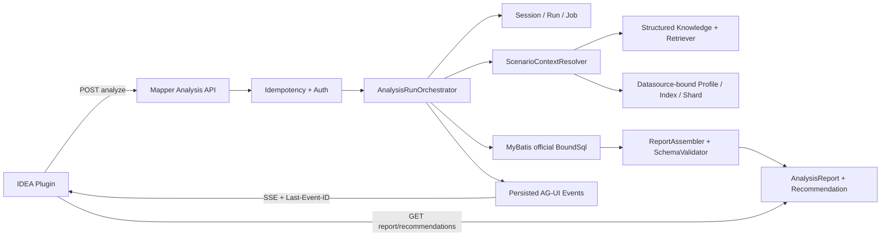

# Claude Code 下一阶段修复与主链路闭环 Goal

> 状态：待执行
> 日期：2026-07-26
> 前置文档：`docs/cloud-code-next-goal.md`、`docs/contracts/`、`docs/persistence-architecture.md`
> 范围：修复当前实现与既定 Goal 的差距；本阶段不进行 IDEA Plugin 视觉重设计

## 1. 本阶段结论

当前实现已经建立 Spring Data JDBC、PostgreSQL/H2 双路径、图书管理系统 Fixture、MyBatis 官方
`BoundSql` 场景生成和标准报告基础，但尚不能声明完成。下一阶段必须先解决以下阻断问题：

1. IDEA Plugin 仍调用已经不存在的 `/api/v1/mapper-statements/plan`。
2. AG-UI 执行链没有调用标准报告和 Recommendation 投影。
3. `/api/v1/mapper-statements/analyze` 不负责建立或验证 Session/Run，正常客户端不能独立调用。
4. 索引、分片和画像只按 client/table 查询，没有按数据源绑定隔离。
5. 报告内外 `reportId` 不一致，场景 `evidenceIds` 被错误用于保存 coverage goal。
6. 画像的周期任务、重试、完整敏感策略和分布断言没有完成。
7. 知识 embedding 发布/回滚只追加旧版本，检索可能返回过期知识。
8. PostgreSQL 中仍可能保留旧产品版本约束名。
9. `Idempotency-Key` 只有 Repository，没有接入 HTTP 创建接口。
10. Docker/CI 门禁和可审查提交尚未完成。

本阶段目标不是继续增加平行 API，而是建立一条唯一、可测试、可恢复的产品主链路。

## 2. 可直接交给 Claude Code 的 Goal

```text
Goal:
修复 SQL Performance Analyzer 当前实现与 docs/cloud-code-next-goal.md 的差距，建立唯一的
IDEA Plugin → 分析命令 → AG-UI/SSE → MyBatis BoundSql → 语义/画像/索引/分片 →
标准报告 → Recommendation 的产品主链路，并完成 PostgreSQL/H2、数据源隔离、幂等和 CI 验收。

执行原则:
1. 开始编码前先输出“现状—目标—缺口—改动文件—测试”矩阵。
2. 严格按 Phase 0 → Phase 4 顺序执行，每个 Phase 先写失败的验收测试，再实现，再重构。
3. 不建立第二条分析链路；REST、AG-UI 和 IDEA Plugin 必须调用同一个应用服务。
4. 不修改已部署的 Flyway 历史版本 2～7 文件，只能新增前向迁移。
5. 不在 Java 中执行 CREATE/ALTER/DROP/TRUNCATE；数据库结构仍只由 Flyway 管理。
6. 不自行编写 MyBatis XML 动态 SQL 解析器，BoundSql 只能来自
   XMLMapperBuilder → MappedStatement.getBoundSql(parameterObject)。
7. 不进行 IDEA Plugin 视觉重设计，只修复为支持既定主链路所必需的交互和契约。
8. 不以测试数量、编译成功或直接调用 Service 的测试代替真实 API/AG-UI 端到端测试。
9. 未运行的 Docker/CI 测试必须明确标为未验证，禁止把 skipped 计为 passed。
10. 完成前先汇报改动范围和建议提交拆分，得到确认后再提交；未经授权不得 push。

必须完成:
A. 统一分析主链路
- 将 POST /api/v1/mapper-statements/analyze 定义为唯一 statement 分析入口。
- IDEA Plugin 删除对 /mapper-statements/plan 的调用，不再把 planJson 拼入 Agent prompt。
- analyze 接口必须原子地创建或验证 Session、Run 和 Job，返回 202、sessionId、runId、
  status 和 streamUrl。
- 同一个 AnalysisRunOrchestrator 同时负责确定性分析、可选 Agent 增强、报告校验与持久化、
  Recommendation 投影和 AG-UI 事件。
- AG-UI 事件必须 persist-first，支持 Last-Event-ID、取消、重试和唯一终态。
- report_ready 后由 REST 读取完整报告；SSE 不传输整份大报告。

B. 修复数据身份和报告证据
- 分析请求必须携带 datasourceProfileId，服务端验证其属于 authenticated clientId。
- 索引、分片、画像查询键必须至少包含
  clientId + datasourceProfileId + schema + table。
- 同一 client 的两个数据源拥有同名表时不得串数据。
- reportId 只生成一次，并在 JSON、数据库、API、事件中完全一致。
- coverageGoals 与 evidenceIds 分离；evidenceIds 只能引用真实 evidence。
- dataDistribution 必须来自 ProfileSnapshot，输出 Top-K、bucket、quantile、null ratio、
  distinct、min/max 及 PROFILE_SNAPSHOT evidence。
- 更新 report-schema，强制每个场景包含 knowledgeVersion、profileSnapshotId、
  evidenceIds、coverageGoals 和 reason。

C. 补齐 Flyway、幂等和认证契约
- 新增 PostgreSQL 前向迁移，清理数据库 metadata 中残留的旧产品版本约束名和索引名。
- 为数据源维度唯一键、知识索引生命周期、画像调度所需结构增加前向迁移。
- H2 baseline 不得回写；H2 使用对应 common/后续迁移达到目标结构。
- 为所有创建型接口真正接入 Idempotency-Key：同键同请求重放原响应；同键异请求返回 409；
  并发同键只能创建一个资源；默认保存 24 小时。
- 缺失/无效/过期 Bearer Token 返回 RFC 9457 的 401，不得返回 400。

D. 补齐画像和知识生命周期
- 画像支持手工任务、周期任务、租约恢复、有限重试/退避和取消。
- 对 bucket、Top-K、null ratio、distinct、min/max、quantile 做确定性结果断言。
- PLAINTEXT/HASHED/OMITTED 三种策略必须验证到存储、日志、事件和报告边界。
- 知识发布/回滚必须让结构化事实和 embedding 的“当前有效版本”一致。
- 不再静默吞掉 embedding 同步失败；使用可恢复状态或持久化任务，并提供重试。
- ScenarioContextResolver 必须实际使用结构化知识和 KnowledgeRetriever 的检索结果，
  library-domain.md 必须通过真实 chunk → fake embedding → retrieval 进入端到端分析。

E. 完成真实验收
- H2 本地门禁必须真实执行，不得依赖 Gradle UP-TO-DATE 结果。
- Docker 门禁必须真实执行 PostgreSQL Repository/Schema parity/PgVector 和 MySQL profiling。
- 完整 E2E 必须从 HTTP analyze 入口开始，经 Run/Job、AG-UI 事件流，最终读取 Report 和
  Recommendation；测试不得预先手工创建 Session/Run 后直接调用 StatementAnalysisService。
- IDEA Plugin consumer contract 必须证明它只调用存在的后端路由。
- 远端 CI 全绿、工作区形成可审查提交后，才能声明 Goal 完成。
```

## 3. 唯一目标架构



设计边界：

- REST 接收业务命令并读取资源。
- AG-UI 定义运行事件语义，SSE 负责持续传输事件。
- `AnalysisRunOrchestrator` 是唯一的分析应用服务入口。
- MyBatis 只负责把场景参数变成真实 `BoundSql`。
- Planner 只负责场景选择和覆盖，不负责持久化或传输。
- ReportAssembler 只组装同一个外部生成的 `reportId`，不得自行生成第二个 ID。
- Repository 必须使用完整资源身份，不能依靠 Controller 已验证来省略查询条件。

## 4. 冻结的 API 与事件契约

### 4.1 创建分析

```http
POST /api/v1/mapper-statements/analyze
Authorization: Bearer <token>
Idempotency-Key: <stable-key>
Content-Type: application/json
```

```json
{
  "artifactId": "artifact_mapper_123",
  "statementId": "findOverdueLoans",
  "datasourceProfileId": "dsp_library",
  "projectId": "library-app",
  "moduleId": "library-dao",
  "sessionId": null,
  "databaseId": "mysql",
  "maxScenarios": 20,
  "userSamples": []
}
```

规则：

- `artifactId`、`statementId`、`datasourceProfileId` 必填。
- `sessionId` 为空时服务端创建 Session；不为空时验证 Session 属于当前 client。
- 服务端创建 Run 和 Job；客户端不得先伪造 Run。
- `datasourceProfileId` 必须属于当前 client，并决定画像、索引和分片的查询范围。
- XML inline 内容只允许测试或明确受限的开发模式；正式 Plugin 使用 Artifact。

成功响应：

```http
HTTP/1.1 202 Accepted
```

```json
{
  "sessionId": "session_123",
  "runId": "run_123",
  "status": "QUEUED",
  "streamUrl": "/api/v1/agui/runs/run_123/stream"
}
```

相同 `Idempotency-Key` 和相同请求必须返回完全相同的 `sessionId/runId`。

### 4.2 AG-UI 事件顺序

成功路径：

```text
RUN_STARTED
CUSTOM spa.phase_changed(PARSING_MAPPER)
CUSTOM spa.phase_changed(RESOLVING_CONTEXT)
CUSTOM spa.scenarios_ready(count, fingerprints)
CUSTOM spa.phase_changed(ASSEMBLING_REPORT)
CUSTOM spa.report_ready(reportId)
CUSTOM spa.recommendations_ready(reportId, count)
RUN_FINISHED
```

失败路径：

```text
RUN_STARTED
...已持久化事件...
RUN_ERROR(code, message, retryable)
RUN_FINISHED
```

取消路径：

```text
RUN_ERROR(code=CANCELLED)
RUN_FINISHED
```

约束：

- 每个 Run 只能有一个终态。
- `report_ready` 只能在报告通过 Schema 校验并持久化后发出。
- `recommendations_ready` 只能在 Recommendation 事务完成后发出。
- 事件必须先入库，再允许 SSE 读取。
- 断线重连使用 `Last-Event-ID`，不得重新创建 Run。

### 4.3 资源读取

```text
GET /api/v1/reports/{reportId}
GET /api/v1/sessions/{sessionId}/recommendations
POST /api/v1/runs/{runId}/cancel
```

以上接口必须验证 `clientId` 资源归属。跨租户访问统一表现为 404，避免泄漏资源存在性。

### 4.4 Plugin 行为

Plugin 的 statement 分析流程固定为：

```text
PSI 取得 statement
→ hash-dedup 上传 Mapper Artifact
→ POST /mapper-statements/analyze
→ 使用 streamUrl 建立 SSE
→ 收到 report_ready 后 GET Report
→ 收到 recommendations_ready 后刷新 Recommendation
```

Plugin 必须删除：

- `/mapper-statements/plan` 调用。
- 将 `planJson` 拼接进 Agent prompt 的逻辑。
- 客户端拼装 knowledge/profile/index/shard 的逻辑。

本阶段不调整 Tool Window 的视觉布局。

## 5. 数据库与持久层设计标准

### 5.1 完整资源身份

| 资源 | 最小唯一身份 |
|---|---|
| IndexDefinition | clientId + datasourceProfileId + schema + table + indexName |
| ShardDefinition | clientId + datasourceProfileId + schema + logicalTable |
| ProfileSnapshot | clientId + datasourceProfileId + snapshotId |
| KnowledgeSource | clientId + sourceId |
| AnalysisReport | clientId + reportId |
| RunEvent | clientId（由 Run/Session 推导）+ runId + eventId |

禁止出现声称按 datasource 隔离、实际 SQL 却只使用 `client_id + table_name` 的 Repository。

### 5.2 Flyway

- Flyway 历史版本 2～7 的 checksum 必须保持不变。
- PostgreSQL 专用的旧约束重命名放入新的 PostgreSQL migration。
- 可移植的数据源字段、唯一约束和新业务表优先放入 `migration-common`。
- H2 clean baseline 不得为了追赶实现而反复修改；已发布后同样通过前向迁移升级。
- 新增数据库 metadata 验收：除历史迁移文件和负责重命名的前向迁移外，运行后的数据库对象名不得包含旧产品版本标记。
- Java 架构扫描继续禁止 DDL。

### 5.3 Repository

- 领域服务依赖 `repository/` Port，不依赖 Spring Data 实现类型。
- 简单 CRUD 使用 Spring Data JDBC。
- 必要的条件查询使用 `NamedParameterJdbcTemplate`，SQL 必须可移植或进入方言 Adapter。
- 所有更新方法检查受影响行数；资源不存在和租户不匹配不得静默成功。
- PostgreSQL/H2 必须执行同一 Repository Contract Test。

### 5.4 Idempotency

HTTP 幂等必须位于业务 Controller 之前或统一应用服务边界，不能要求每个 Controller 自己复制逻辑。

请求摘要至少包含：

```text
clientId + method + normalizedPath + canonicalJsonBody
```

并发要求：

- 第一个请求原子取得 key。
- 同摘要并发请求等待或重放同一结果。
- 不同摘要立即返回 409 Problem Details。
- 失败响应是否缓存必须形成统一策略；至少 5xx 不得永久缓存。

## 6. 报告与证据设计标准

### 6.1 报告身份

`reportId` 由 Orchestrator 生成一次，并传入：

```text
ReportAssembler
→ report JSON
→ AnalysisReport primary key
→ REST response
→ spa.report_ready
→ spa.recommendations_ready
```

必须有测试对以上五处做相等断言。

### 6.2 Evidence

每条 evidence 至少包含：

```json
{
  "evidenceId": "ev_...",
  "sourceType": "PROFILE_SNAPSHOT",
  "sourceId": "snap_123",
  "version": 1,
  "locator": "loan.status",
  "collectedAt": "2026-07-26T00:00:00Z",
  "confidence": 0.95
}
```

`evidenceId` 必须稳定，并能在报告的 evidence catalog 中找到。

场景字段必须分离：

```json
{
  "coverageGoals": ["SHARD_SINGLE", "FOREACH_MULTI"],
  "evidenceIds": ["ev_shard_loan", "ev_profile_loan_status"],
  "reason": "验证单分片路由并覆盖高频 ACTIVE 状态"
}
```

禁止把 coverage goal 冒充 evidence ID。

### 6.3 Data distribution

`dataDistribution` 只能描述画像数据，不得用普通 TABLE/COLUMN 业务语义填充。至少支持：

- table/column
- nullRatio
- approximateDistinct
- min/max
- Top-K
- buckets
- quantiles
- sensitivity policy
- snapshot evidence

敏感字段要求：

- `PLAINTEXT`：仅非敏感字段允许。
- `HASHED`：报告和事件只出现稳定 hash，不出现原值。
- `OMITTED`：报告只允许出现频次或“已省略”，不得出现原值或 hash。

### 6.4 Schema 版本

本次属于契约增强，应将报告 Schema 升级为 `1.1`，并满足：

- `docs/contracts/report-schema.json` 与 classpath Schema 字节一致。
- `scenario` 强制要求 `coverageGoals/evidenceIds/reason`。
- `audit` 强制要求 datasource binding。
- evidence 强制要求 `evidenceId/sourceType/sourceId/version/locator/collectedAt/confidence`。
- Plugin 对未知的新增字段保持容错。

## 7. 知识与画像生命周期标准

### 7.1 知识发布和回滚

结构化事实与 embedding 必须共享同一个“当前有效版本”语义：

```text
DRAFT
→ PUBLISHING
→ PUBLISHED + embedding ACTIVE
→ 新版本发布后旧版本 INACTIVE
→ rollback 后目标版本重新 ACTIVE
```

不允许：

- 发布成功但 embedding 失败且没有任何可见状态。
- 捕获异常后静默忽略。
- search 在未指定历史版本时返回 INACTIVE/ROLLED_BACK 版本。

如果 embedding 系统不能与管理数据库共享事务，使用持久化索引任务：

```text
knowledge_index_job
QUEUED → RUNNING → COMPLETED / RETRYING / FAILED
```

### 7.2 画像任务

画像任务最小状态机：

```text
QUEUED
→ RUNNING
→ COMPLETED
→ RETRYING → RUNNING
→ FAILED
→ CANCELLED
```

要求：

- 周期配置生成普通 Job，不建立第二套执行逻辑。
- lease 到期的 RUNNING Job 可安全恢复。
- 最大重试次数和退避时间配置化。
- 取消后 worker 在表/列边界检查状态并停止。
- Snapshot 完成后不可修改；失败 Snapshot 不得成为 latest effective snapshot。
- `latest` 查询必须限定 clientId + datasourceProfileId。

## 8. 分阶段开发计划

### Phase 0：契约冻结与失败测试

先建立以下失败测试，不修改实现来规避失败：

1. `StatementAnalysisApiContractTest`
   - `/analyze` 返回 202。
   - 自动创建 Session/Run。
   - 数据源归属错误返回 404。
2. `PluginBackendConsumerContractTest`
   - Plugin 不得请求 `/plan`。
   - 请求 `/analyze` 后连接返回的 stream URL。
3. `AnalysisAguiEndToEndTest`
   - HTTP → Run → events → report → recommendations。
4. `ReportIdentityAndEvidenceTest`
   - 五处 reportId 相等。
   - evidence 引用完整。
5. `DatasourceIsolationContractTest`
   - 同 client、两个 datasource、同名 `loan` 不串数据。

Phase 0 输出契约差异清单；测试应先红，再进入 Phase 1。

Phase 0 测试质量门禁：

- 所有调用 `/analyze` 的测试都必须创建并传入属于当前 client 的 `datasourceProfileId`；
  只有“外部数据源”负向测试例外。
- `/analyze` 请求必须携带稳定的 `Idempotency-Key`，重复请求测试复用同一个 key。
- 不允许使用无条件 `fail()` 代替未来行为断言。接口尚不存在时，应通过面向 HTTP 的行为测试，
  或通过反射验证并调用目标签名，使实现完成后测试能够在不删除断言的情况下自然转绿。
- Plugin consumer contract 应在 `idea-plugin` 测试模块中通过 mock HTTP server 验证真实请求路径；
  后端源码扫描只能作为补充，不能代替消费者测试。
- 报告读取使用冻结的 `GET /api/v1/reports/{reportId}`。测试必须从
  `spa.report_ready` 事件取得 `reportId`，不得自行假设 `/runs/{runId}/report` 路由。
- 异步测试必须有明确超时、轮询/事件终止条件，禁止创建 Run 后立即读取报告形成竞态。
- HTTP 返回 202 后，分析必须由真实 Job/Worker 或受控异步执行器完成；不得在请求线程同步生成报告后
  仅把状态码改成 202。端到端测试必须启用对应 worker，并证明响应先于终态完成。
- Report identity 测试必须实际覆盖 JSON、数据库主键、REST 返回和两个 AG-UI ready 事件；
  测试名称中声明的边界不得只由 Repository 查询冒充。
- `dataDistribution` 至少断言 null ratio、distinct、min/max、Top-K、bucket、quantile、
  sensitivity policy 和 `PROFILE_SNAPSHOT` evidence，而不只检查其中三项。
- 数据源隔离除了“同 client、两个 datasource、同名表”，还要覆盖同一 datasource 下的同名表跨 schema。

### Phase 1：统一分析主链路

1. 引入 `AnalysisRunOrchestrator`。
2. 将 Session/Run/Job 创建和权限校验移动到统一事务边界。
3. 让 `/analyze` 只调用 Orchestrator。
4. 让执行器调用同一个场景、报告、建议流程。
5. 修复 Plugin 调用顺序并删除 `/plan`。
6. 完成成功、失败、取消、续传事件测试。

Phase 1 验收：IDEA consumer contract 与 H2 API E2E 通过。

### Phase 2：数据源隔离、报告和数据库迁移

1. 增加 `datasourceProfileId` 数据模型和前向迁移。
2. 修复 Metadata/Profile/ScenarioContext 查询键。
3. 新增同租户跨数据源负向测试。
4. 单点生成 reportId。
5. 升级 Report Schema 1.1。
6. 分离 coverage goals 与 evidence IDs。
7. 将真实画像投影到 `dataDistribution`。
8. 新增 PostgreSQL 旧约束名清理迁移和数据库 metadata 测试。

Phase 2 验收：H2/PG Repository parity、Schema parity、Report Schema 和 marker metadata 测试通过。

### Phase 3：画像与知识生命周期

1. 实现画像周期配置、重试、租约恢复和取消。
2. 补齐所有分布指标和敏感策略测试。
3. 实现 active embedding version 或持久化 indexing job。
4. 发布/回滚切换结构化事实和检索版本。
5. ScenarioContextResolver 接入真实 Retriever。
6. 图书 E2E 使用 `library-domain.md` 和 Excel 发布链路。

Phase 3 验收：有/无知识、有/无画像、不同数据源产生可解释且不同的场景和报告。

### Phase 4：幂等、错误语义与全门禁

1. 接入 HTTP `Idempotency-Key`。
2. 修复 401/404/409 Problem Details。
3. 运行 clean H2 门禁。
4. 运行 PostgreSQL/PgVector/MySQL Docker 门禁。
5. 运行 Plugin contract 和打包。
6. 扫描生产源码、文档和数据库 metadata。
7. 汇报改动、测试实际执行数、skipped 数和提交拆分。
8. 经用户确认后提交；push 后等待 CI。

## 9. 验收矩阵

| 能力 | 必须新增或强化的测试 | H2 本地 | PG/MySQL Docker |
|---|---|---:|---:|
| API 主链路 | `StatementAnalysisApiContractTest` | 必跑 | 必跑 |
| AG-UI 闭环 | `AnalysisAguiEndToEndTest` | 必跑 | 必跑 |
| Plugin 路由 | `PluginBackendConsumerContractTest` | 必跑 | 不要求 |
| reportId/证据 | `ReportIdentityAndEvidenceTest` | 必跑 | 必跑 |
| 数据源隔离 | `DatasourceIsolationContractTest` | 必跑 | 必跑 |
| Repository parity | 现有 contract 扩展 datasource key | 必跑 | 必跑 |
| Flyway/Schema | migration + parity + DB marker scan | H2 migration | 必跑 |
| HTTP 幂等 | replay/conflict/concurrency API test | 必跑 | 必跑 |
| 画像分布 | bucket/topK/null/distinct/minmax/quantile | 管理库存储 | MySQL target |
| 画像调度 | manual/periodic/lease/retry/cancel | 必跑 | 必跑 |
| 敏感策略 | plaintext/hashed/omitted 全边界 | 必跑 | 必跑 |
| 知识版本 | publish/rollback/active retrieval | 必跑 | PgVector 必跑 |
| 图书完整 E2E | HTTP→AG-UI→Report→Recommendation | 必跑 | 至少 PG 管理库复跑 |
| 跨租户 | 七类资源 + report/event | 必跑 | 必跑 |

额外断言：

- Docker 条件测试在本地无 Docker 时可以明确 skipped。
- CI 设置强制变量后，以上 Docker 测试的 skipped 数必须为 0。
- 测试报告必须同时汇报 discovered、executed、passed、failed、skipped，不能只报总数。
- Gradle `UP-TO-DATE` 不能作为“本次已实跑”的证据。

## 10. 建议验收命令

本地强制重跑：

```bash
./gradlew clean test bootJar --no-daemon --console=plain
./gradlew :idea-plugin:clean :idea-plugin:contractTest :idea-plugin:buildPlugin \
  :idea-plugin:verifyPluginStructure --no-daemon --console=plain
bash scripts/acceptance.sh --local
```

具备 Docker 的外部门禁：

```bash
RUN_POSTGRES_INTEGRATION_TESTS=true \
  ./gradlew clean test bootJar --no-daemon --console=plain
```

要求 Claude Code 在汇报中列出：

```text
backend: discovered / executed / passed / failed / skipped
plugin:  discovered / executed / passed / failed / skipped
Docker containers actually started:
- PostgreSQL:
- MySQL:
- pgvector:
CI URL / run id:
```

## 11. 建议提交拆分

所有提交都必须保持可编译且测试为绿，不提交永久失败测试。

1. `fix: unify statement analysis and AG-UI execution path`
   - API、Orchestrator、Plugin consumer、AG-UI E2E。
2. `fix: scope metadata and reports by datasource evidence`
   - datasource identity、Report 1.1、evidence、Flyway migrations。
3. `feat: complete profiling and knowledge version lifecycle`
   - profiling schedule/retry/cancel、embedding active version、图书 E2E。
4. `fix: enforce HTTP idempotency and final acceptance gates`
   - idempotency、Problem Details、CI/acceptance、文档收口。

提交前必须先向用户汇报：

- 每个提交的文件范围。
- 是否包含迁移以及回滚说明。
- 实际执行的测试和 skipped 数。
- 尚未验证的外部条件。

## 12. 完成定义

只有同时满足以下条件，Claude Code 才能声明完成：

- IDEA Plugin 不再访问不存在的 `/plan`。
- 真实 HTTP 分析请求可以在不预建 Session/Run 的情况下完成。
- AG-UI 主链路生成并通知标准 Report 和 Recommendation。
- reportId 在 JSON、数据库、REST、AG-UI 中一致。
- 同 client 的不同 datasource 同名表完全隔离。
- 场景 coverage 与 evidence 含义正确且 Schema 强制校验。
- Profile 数据真实进入报告，并完成全部分布与敏感策略测试。
- 知识回滚后默认检索不会返回失效版本。
- PostgreSQL 运行后数据库对象名不存在旧产品版本标记。
- Idempotency-Key 在真实 HTTP API 生效。
- H2 本地门禁真实执行通过。
- PostgreSQL/PgVector/MySQL Docker 门禁真实执行通过且强制测试无 skipped。
- Plugin contract、打包和结构校验通过。
- 图书 E2E 从 HTTP/AG-UI 入口开始，而不是直接调用内部 Service。
- 改动已形成可审查提交。
- push 后远端 CI 全绿。

任何一项未满足，都必须报告为“部分完成”或“被明确条件阻塞”，不得使用“全部完成”。
