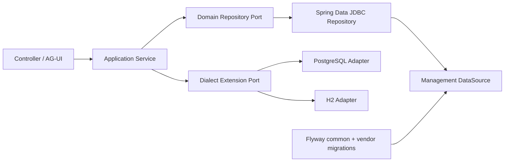
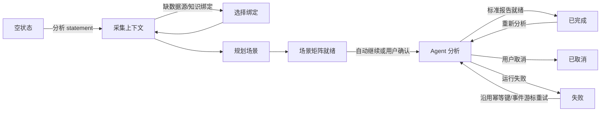

# Cloud Code 下一阶段开发 Goal

> 状态：待执行；IDEA Plugin 核心交互决策已确认，UI 实施另立 Goal
> 日期：2026-07-25
> 适用仓库：`sql-performace-analyzer`
> 前置文档：`docs/architecture.md`、`docs/operations.md`、`docs/contracts/`

## 1. 本阶段结论

下一阶段不继续堆叠 PostgreSQL 专用 DAO，也不先实现新的 IDEA Plugin 界面。开发顺序固定为：

1. 将产品持久层改造成 PostgreSQL/H2 双数据库可运行的中立架构。
2. 用图书管理系统建立可重复的 TDD 验收基准。
3. 为索引/分片/二级分片、数据画像、Excel 知识库建立明确的单元测试和双数据库集成测试。
4. 接通“业务语义与画像 → 场景规划 → MyBatis 官方 BoundSql → 标准报告”的服务端链路。
5. IDEA Plugin 核心交互决策已经确认；本阶段只冻结必要契约，具体 UI 实施另立 Goal。

业务语义驱动场景生成不追求一次性覆盖所有行业。当前只以图书管理系统作为受控样例域，通过测试证明架构能够接受业务语义、画像、索引和分片证据，并生成可解释的 SQL 场景。

## 2. 可直接交给 Cloud Code 的 Goal

```text
Goal:
把 SQL Performance Analyzer 重构为 PostgreSQL/H2 双数据库可运行、可测试、可审计的系统，并用图书管理系统完成业务语义驱动的 MyBatis SQL 分析端到端验收。

必须完成：
1. 用 Spring Data JDBC 建立数据库中立的领域持久层，替换业务代码对 Postgres*Dao 和 PostgreSQL SQL 的直接依赖。
2. 所有建库建表、约束、索引和数据升级只允许存在于 Flyway migration；Java Repository/DAO 中禁止 CREATE/ALTER/DROP/TRUNCATE。
3. PostgreSQL 与 H2 必须通过同一套 Repository Contract Test 和服务层测试。
4. AgentScope 状态存储必须通过统一 Provider 选择：PostgreSQL 可用官方 PostgresDistributedStore；H2 必须具有可持久化、可重启恢复的 AgentStateStore + BaseStore 组合，不得用纯内存实现冒充完成。
5. 修复所有 clientId 租户隔离问题；知识、画像、索引、分片、报告和事件查询必须验证资源归属。
6. 为索引/分片/二级分片、数据画像、Excel 知识库分别建立明确的单元测试、H2 集成测试和 PostgreSQL Testcontainers 测试。
7. 建立图书管理系统 fixture：数据库、种子数据、MyBatis Mapper、业务语义 Markdown、Excel 知识文件、画像快照、索引和分片定义。
8. 服务端根据已认证 clientId 和 statement 引用自动加载业务知识、画像、索引及分片信息；IDEA 客户端不得负责拼装可信知识输入。
9. 所有动态 SQL 必须通过 MyBatis 官方 XMLMapperBuilder -> MappedStatement.getBoundSql(parameterObject) 生成。
10. 实现并持久化符合 report-schema.json 的标准报告，AG-UI 主链路投影 Report 和 Recommendation。
11. 不实现新的 IDEA Plugin UI；核心交互决策已经冻结，本阶段只完成后端与 Plugin 所需契约，UI 实施另立 Goal。

完成定义：
- H2 无 Docker 本地门禁通过。
- PostgreSQL Testcontainers 门禁在 CI 中强制执行，不允许通过 assumeTrue 静默跳过。
- 图书管理系统端到端测试证明知识、画像、索引/分片证据真实影响场景生成和报告。
- 跨租户负向测试全部通过。
- 工作区改动形成可审查提交，CI 全绿后才允许声明完成。
```

## 3. 数据库中立持久层

### 3.1 范围边界

需要分别处理两类存储，不能只替换产品 DAO 后就声称支持 H2。

| 存储边界 | 当前问题 | 本阶段目标 |
|---|---|---|
| 产品业务数据 | `Postgres*Dao` 内嵌大量 PostgreSQL SQL | Spring Data JDBC 领域实体与 Repository，PostgreSQL/H2 共用 |
| AgentScope State/Workspace | 直接构造 `PostgresDistributedStore` | `AgentScopeStoreProvider` 按数据库选择可持久化实现 |
| 知识嵌入与检索 | PgVector 专用 | `KnowledgeRetriever` 中立接口；PostgreSQL/H2 使用不同索引 Adapter |
| 被分析的目标数据库 | MySQL/GoldenDB 等只读数据源 | 与管理数据库解耦，不因管理库改成 H2 而改变目标库方言 |

“支持 H2”至少意味着：应用能以 H2 作为管理数据库启动，产品数据和 Agent Session 状态可以重启恢复，图书系统完整验收能够运行。PgVector 可以在 H2 模式不可用，但 Markdown 仍必须完成切块、嵌入、保存和检索，不能把“无 PgVector”解释为“无业务知识”。

### 3.2 技术决策

采用：

- Spring Data JDBC：领域实体、Repository、事务和常规 CRUD。
- Flyway：唯一数据库结构事实来源。
- `NamedParameterJdbcTemplate`：仅用于无法由 Spring Data JDBC 清晰表达的批量或条件查询。
- 方言 SPI：只容纳真实数据库差异。

本阶段不采用 Hibernate 自动建表。即使后续选择 Spring Data JPA，也必须设置为只校验 Schema，不能由 ORM 在运行时创建或更新生产表。

选择 Spring Data JDBC 的原因：

- 与当前 Spring JDBC 代码迁移成本较低。
- 聚合和 SQL 行为更显式，适合审计型后台服务。
- 不引入 Lazy Loading、隐式级联和复杂 Session 生命周期。
- Repository 和实体仍能一眼说明“存了什么、如何关联”。

### 3.3 目标分层



建议包结构：

```text
com.biz.sccba.sqlanalyzer
├── domain/
│   ├── identity/
│   ├── analysis/
│   ├── artifact/
│   ├── knowledge/
│   ├── metadata/
│   ├── profiling/
│   └── report/
├── repository/
│   ├── ClientRepository.java
│   ├── SessionRepository.java
│   ├── KnowledgeSourceRepository.java
│   ├── MetadataRepository.java
│   ├── ProfilingRepository.java
│   └── AnalysisReportRepository.java
├── persistence/
│   ├── jdbc/
│   │   ├── entity/
│   │   ├── repository/
│   │   └── mapper/
│   └── dialect/
│       ├── ManagementDatabaseDialect.java
│       ├── JobClaimStrategy.java
│       ├── PostgreSqlDialectAdapter.java
│       └── H2DialectAdapter.java
└── agentscope/store/
    ├── AgentScopeStoreProvider.java
    ├── PostgreSqlAgentScopeStoreProvider.java
    └── H2AgentScopeStoreProvider.java
```

服务层只依赖领域 Repository，不得依赖 `Postgres*` 或 `H2*` 类型。

知识检索另设 `KnowledgeRetriever` 端口：

- PostgreSQL Adapter 可以使用 PgVector。
- H2/dev Adapter 将 embedding 以可移植格式持久化，在受限候选集上由 JVM 计算 cosine similarity。
- 测试使用确定性的 Fake Embedding Model，不能调用外部模型导致结果漂移。
- 结构化检索与向量检索结果使用同一 Evidence DTO，均携带 source/version/locator。

### 3.4 数据模型目录

必须用实体类、关系说明和一张 ER 图表达以下存储模型：

| 聚合 | 核心信息 |
|---|---|
| Client/Token | 客户端身份、Token 哈希、吊销状态 |
| Session/Message | 会话及消息历史 |
| AgentRun/Job/Event | Run 生命周期、任务租约、可续传事件 |
| Artifact/Document/Chunk | Mapper、Excel、Markdown、日志等证据 |
| KnowledgeSource/Version | 知识来源、草稿、发布、回滚 |
| Table/Column/Rule/Enum/Alias | 结构化业务语义与证据定位 |
| DatasourceProfile | 只读目标数据源引用，不保存密码 |
| ProfilingJob/Snapshot/ColumnStat | 画像任务、快照、Top-K、桶和分位数 |
| IndexDefinition | 索引列顺序、类型、基数、来源和版本 |
| ShardDefinition | 主分片键、二级分片键、算法、物理拓扑 |
| MetadataConflict | 自动采集与人工定义的冲突 |
| AnalysisReport | 标准报告 JSON、Markdown 投影、Schema 版本 |
| Recommendation/Feedback | 建议与用户接受/拒绝反馈 |
| IdempotencyRecord | clientId、幂等键、请求摘要、响应和过期时间 |

所有业务资源表必须能追溯到 `client_id`。不能只在 Controller 校验 Token，然后用不带 clientId 的 Repository 查询。

### 3.5 Flyway 规划

已有 PostgreSQL Flyway 历史视为已部署，禁止修改现存历史迁移的内容或 checksum。

建议位置：

```text
src/main/resources/db/
├── migration/                 # 已存在的 PostgreSQL 历史迁移，保持不动
├── migration-common/          # V8 起真正可移植的前向迁移
└── migration-h2/              # H2 clean install baseline 和必要方言迁移
```

启动时通过 JDBC metadata 决定 Flyway locations：

- PostgreSQL：`db/migration` + `db/migration-common`
- H2：`db/migration-h2` + `db/migration-common`

约束：

- H2 baseline 必须表达与 PostgreSQL 当前目标 Schema 等价的结构。
- 后续优先写可移植的 common migration。
- `jsonb`、`ON CONFLICT`、`SKIP LOCKED`、特定 sequence 语法等只能进入方言 migration/adapter。
- 不以 H2 PostgreSQL compatibility mode 掩盖方言依赖；可以启用兼容模式方便本地使用，但测试必须发现不必要的专用 SQL。
- 新迁移负责清理尚存的产品版本约束名和关联索引名。

### 3.6 AgentScope Store

当前 `PostgresDistributedStore` 不是数据库中立实现。目标接口：

```text
AgentScopeStoreProvider
└── DistributedStore create(DataSource, ManagementDatabaseDialect)
```

实现要求：

- PostgreSQL：允许继续使用官方 `PostgresDistributedStore`。
- H2：组合持久化 `AgentStateStore` 与 `BaseStore`；数据必须落 H2，支持 `(userId, sessionId)` 隔离、版本比较和重启恢复。
- `InMemoryAgentStateStore`/`InMemoryStore` 只能用于纯单元测试。
- H2 和 PostgreSQL 都必须通过同一套状态恢复、同 Session 串行、跨 Session 隔离测试。

如果 H2 的 `BaseStore` 无法在本阶段安全完成，必须在交付说明中明确阻塞，不得悄悄切换为内存并声称 H2 已完整支持。

### 3.7 架构守卫

增加自动化守卫：

- Java 生产源码不得出现 `CREATE TABLE`、`ALTER TABLE`、`DROP TABLE`、`TRUNCATE TABLE`。
- `service`、`controller`、`domain` 包不得 import `adapter.postgresql` 或 `adapter.h2`。
- Repository 接口不得以数据库厂商命名。
- PostgreSQL/H2 Schema 归一化快照必须具有相同表、列、主外键和业务索引。
- 所有按资源 ID 查询的方法必须同时接受或推导 `clientId`。

建议使用 ArchUnit 加普通文本扫描实现上述门禁。

## 4. 图书管理系统 TDD 基准

### 4.1 Fixture 目录

```text
src/test/resources/fixtures/library/
├── schema/
│   ├── library-common.sql
│   └── seed-data.sql
├── mapper/
│   ├── BookMapper.xml
│   ├── LoanMapper.xml
│   └── ReservationMapper.xml
├── knowledge/
│   ├── library-domain.md
│   └── library-knowledge.xlsx
├── profiles/
│   └── expected-profile.json
└── metadata/
    ├── indexes.json
    └── shards.json
```

Excel 是结构化导入来源；Markdown 是可审查的业务语义落地文件和嵌入文档。Excel 发布后应生成或更新规范化 Markdown 文档，两者不能成为互不一致的两套事实。

### 4.2 业务表

| 表 | 业务含义 | 关键字段 |
|---|---|---|
| `library_branch` | 图书馆分馆 | `id`、`name`、`region_code` |
| `book` | 书目 | `id`、`isbn`、`title`、`category`、`status` |
| `book_copy` | 馆藏副本 | `id`、`book_id`、`branch_id`、`shelf_code`、`status` |
| `member` | 读者 | `id`、`member_no`、`level`、`status`、`home_branch_id` |
| `loan` | 借阅记录 | `id`、`member_id`、`copy_id`、`borrowed_at`、`due_at`、`returned_at`、`status` |
| `reservation` | 预约记录 | `id`、`member_id`、`book_id`、`branch_id`、`priority`、`status` |

固定业务规则示例：

- 一本书可以有多个馆藏副本。
- `book_copy.status=AVAILABLE` 才能新建借阅。
- 活跃借阅的 `returned_at` 必须为空。
- 逾期定义为 `status=ACTIVE AND due_at < now`。
- 读者等级决定最大借阅数量。
- `member_no` 属于敏感业务标识，画像中使用 HASHED。
- `isbn` 可明文用于精确检索。
- `loan` 主分片键为 `member_id`，二级分片键为 `borrowed_at`，用于会员桶和月份路由。

### 4.3 索引和分片 Fixture

至少包含：

- `book(isbn)` 唯一索引。
- `book(category, status)` 联合索引。
- `book_copy(branch_id, status, book_id)` 联合索引。
- `loan(member_id, status, due_at)` 联合索引。
- `loan(copy_id, status)` 联合索引。
- `reservation(book_id, branch_id, status, priority)` 联合索引。
- `loan` 主分片 `member_id`。
- `loan` 二级分片 `borrowed_at`。
- 缺少分片键导致跨分片、缺少二级分片键扩大时间分区扫描的场景。

### 4.4 MyBatis 动态 SQL

必须覆盖至少三个 statement：

1. `BookMapper.searchAvailableBooks`
   - 可选 `keyword/category/branchId`
   - `categories` foreach：空、单值、多值
   - `choose` 控制排序
   - `${orderBy}` 仅接受业务知识中的显式白名单
2. `LoanMapper.findOverdueLoans`
   - `memberId/branchId/dueBefore/statuses`
   - 有/无主分片键
   - 有/无二级分片时间范围
3. `ReservationMapper.findQueue`
   - `bookId/branchId/status`
   - 高频分馆与热点书目场景

测试只负责构造参数对象；最终 SQL 必须来自 MyBatis 官方 `MappedStatement.getBoundSql()`。

### 4.5 业务语义 Markdown

`library-domain.md` 至少包含以下可机器识别且可人工阅读的章节：

```markdown
# 图书管理系统业务语义
## 表定义
## 字段定义
## 枚举
## 业务规则
## 敏感级别
## 索引事实
## 分片与二级分片规则
## 查询主路径
## 边界与异常场景
## 别名
## 证据版本
```

每条知识必须带稳定 ID、来源版本和定位信息。嵌入检索结果必须返回这些证据字段，不能只返回无来源的模型摘要。

测试中的 Markdown 必须经过真实的切块、embedding port 和检索流程。可以使用确定性 Fake Embedding Model，但不能绕过嵌入流程，直接把期望知识对象塞给 Planner。

### 4.6 端到端预期

以 `findOverdueLoans` 为例：

1. IDEA/测试客户端只发送 Mapper Artifact、statementId、数据源绑定和用户可选样例。
2. 服务端解析 statement 引用的表、字段和参数。
3. 服务端按 clientId 自动加载已发布的图书业务知识、最新有效画像、索引和分片定义。
4. Planner 产生：
   - 典型逾期借阅主路径。
   - 指定 memberId 的单主分片场景。
   - 缺少 memberId 的跨分片场景。
   - 带/不带 borrowedAt 范围的二级分片场景。
   - statuses foreach 空、单值、多值场景。
   - dueAt 边界和高频/低频值场景。
5. MyBatis 官方运行时生成 BoundSql，并按指纹去重，总数不超过 20。
6. 报告引用知识版本、画像快照、索引/分片证据和每个场景的生成理由。

## 5. 测试驱动开发与验收矩阵

实现顺序必须遵循 Red → Green → Refactor。先提交失败测试或在同一变更中保留可审查的测试意图，再写实现。

### 5.1 数据库中立 Repository

同一套 Repository Contract Test 必须分别运行：

- H2：每次本地构建强制运行。
- PostgreSQL Testcontainers：CI 强制运行。

覆盖：

- CRUD 与乐观更新。
- 事务回滚。
- 时间戳和 nullable 字段。
- JSON 文本序列化。
- 唯一约束和外键。
- Run Event 游标顺序。
- Job claim/lease/retry。
- clientId 资源隔离。
- 幂等键同请求重放和异请求冲突。

### 5.2 索引、分片、二级分片

必须有：

- `MetadataServiceTest`：人工记录不会被自动采集覆盖。
- 冲突创建、接受、拒绝和版本递增。
- 索引列顺序不丢失。
- 主分片键和二级分片键分别保存、查询和投影。
- 相同表名在不同 client/datasource 下不串数据。
- 图书 `loan` 单分片、跨分片、二级时间分片场景。
- H2/PostgreSQL Repository parity。

### 5.3 数据画像

必须有：

- 桶、Top-K、null ratio、distinct、min/max、quantile 的确定性测试。
- `PLAINTEXT/HASHED/OMITTED` 三种敏感策略。
- `member_no` 不得以明文进入数据库、日志、事件或报告。
- 图书分类倾斜、热门分馆、借阅状态分布的固定断言。
- 手工任务、周期任务、租约回收、重试、取消。
- 快照不可变和 client 所有权校验。
- H2 作为管理库时画像结果可持久化和重启恢复。
- MySQL/GoldenDB 目标方言测试与管理数据库测试分开。

### 5.4 Excel 知识库

必须有：

- 正常模板解析。
- 缺列、错误枚举、重复键、非法敏感策略等逐行错误。
- preview 不污染已发布知识。
- publish 原子切换版本。
- rollback 恢复前一版本。
- Excel Artifact 与知识版本可追溯。
- 规范化 Markdown 生成和嵌入调用。
- H2 portable embedding 与 PostgreSQL PgVector Adapter 遵守同一 `KnowledgeRetriever` contract。
- 检索结果带知识 ID、版本、Sheet/行号和置信度。
- 不同 client 的同名表、字段、枚举完全隔离。
- H2/PostgreSQL 持久化行为一致。

### 5.5 业务语义驱动场景

必须证明“有语义”和“无语义”结果不同：

- 无知识时只生成结构覆盖和安全默认值。
- 发布 `library-domain.md` 后，生成真实枚举、主路径、索引/分片敏感场景。
- 发布画像后，增加高频、低频、范围边界和热点场景。
- 用户样例保留最高可信来源并占预留槽位。
- `${}` 没有白名单时标记风险且不生成任意值；有白名单时只使用白名单。
- 每个场景记录 `knowledgeVersion/profileSnapshotId/evidenceIds/reason`。
- 输入相同则场景集合和排序稳定，随机 UUID 不得影响业务断言。

### 5.6 标准报告主链路

必须有一个完整测试：

```text
图书 Mapper
  → 服务端自动解析语义引用
  → 加载 Markdown/Excel 知识
  → 加载画像、索引、分片
  → 规划参数场景
  → MyBatis BoundSql
  → Agent/确定性测试替身分析
  → 校验 report-schema.json
  → 持久化 AnalysisReport
  → 投影 Recommendation
  → AG-UI report_ready/recommendations_ready
```

测试不能由客户端直接把期望的 knowledge/profile/index/shard 数组传给 Planner 来伪造闭环。

## 6. IDEA Plugin 交互设计草案

本节是已确认的核心交互基线。本阶段只冻结后端契约和 Plugin 设计，不直接改 UI；具体视觉稿、组件细节和界面编码另立独立 Goal。

### 6.1 设计目标

- 分析入口贴近 MyBatis statement，而不是要求用户先进入 Tool Window 填 ID。
- 默认流程一键完成；缺少数据源或知识绑定时才要求补充。
- 报告优先，Agent token 流不是主界面。
- 所有结论都能追溯到场景和证据。
- 用户可以取消、重试、接受/拒绝建议，并看到这些操作的结果。

### 6.2 入口

在 `<select>/<update>/<delete>/<insert>` statement 上提供：

- 编辑器 gutter 图标。
- 右键菜单“分析 SQL 性能”。
- `Alt/Option + Enter` intention。

点击后 PSI 自动取得：

- project/module
- mapperPath
- namespace/statementId
- statementType
- contentHash
- MyBatis 配置和可解析参数类型

不弹出要求手工输入 namespace、statementId 或 runId 的对话框。

### 6.3 Tool Window 信息架构

```text
┌ SQL Analyzer ───────────────────────────────────────────────────────┐
│ UserMapper.xml / findOverdueLoans   DataSource: Library-Dev       │
│ Knowledge: library@v3   Profile: snap_20260725   [重新分析] [取消] │
├────────────────────────────────────────────────────────────────────┤
│ [报告] [场景矩阵] [证据] [运行日志]                                │
├────────────────────────────────────────────────────────────────────┤
│ 报告 Tab                                                           │
│  严重度 / 置信度 / 核心瓶颈                                        │
│  关键发现                                                          │
│  ├ 跨分片扫描（证据 3）                                            │
│  ├ loan(member_id,status,due_at) 未被利用（场景 5）                 │
│  └ 热点分馆导致数据倾斜（画像 snap_...）                            │
│                                                                    │
│  优化建议                                        [接受] [拒绝]     │
│  限制与缺失证据                                                    │
└────────────────────────────────────────────────────────────────────┘
```

四个主 Tab：

1. **报告**
   - 摘要、严重度、置信度、关键瓶颈。
   - 风险和建议。
   - 接受/拒绝建议。
   - 限制与缺失证据。
2. **场景矩阵**
   - 场景名称、来源、参数摘要、分支覆盖、BoundSql 指纹、风险。
   - 点击行后查看完整 BoundSql、参数映射和生成理由。
   - 敏感参数只显示哈希或掩码。
3. **证据**
   - 业务知识、画像、索引、分片、执行计划。
   - 展示 source/version/locator/snapshot。
   - 点击证据可定位到 Mapper、Markdown 或 Excel 来源描述。
4. **运行日志**
   - AG-UI 事件流、工具调用、重连状态。
   - 默认折叠推理细节，不能盖过最终报告。

### 6.4 核心流程



建议默认在场景规划完成后自动进入分析，同时允许用户在设置中启用“运行前检查场景矩阵”。这样新用户一键完成，专业用户仍可控制分析成本。

### 6.5 状态反馈

必须明确区分：

- 正在上传/内容已去重。
- 正在加载知识和画像。
- 正在生成场景。
- Agent 正在分析。
- SSE 断线重连中，并显示最后事件 ID。
- 已取消、取消失败、已完成、报告投影失败。
- 缺少知识与“知识检索服务不可用”不是同一状态。

取消按钮必须持有当前 `runId` 和活动 SSE 客户端引用；不能只在 UI 中放一个永远为空的字段。

### 6.6 设置

Project 级设置：

- 服务端地址。
- 默认数据源绑定。
- 默认知识源/版本策略。
- 是否在运行前审查场景。
- 最大场景数和分析成本提示。

Application 级安全设置：

- Token 只存 PasswordSafe。
- 不显示或记录明文 Token。

### 6.7 已确认的交互决策

总体原则：默认流程尽量一键完成，但临时信息、数据源选择和更新类语句分析必须保持可见、可追溯，且不能产生隐式副作用。

| 议题 | 已确认决策 |
|---|---|
| 场景规划后的运行方式 | 默认自动运行；提供“运行前检查场景矩阵”项目级选项 |
| 报告与建议 | 合并在同一个“报告”Tab |
| 证据定位 | 支持直接定位；无法打开原文件时展示来源坐标和证据内容 |
| 一次性业务规则 | 允许作为当前 Run 的临时上下文；不得自动写入知识库或长期记忆 |
| 多数据源绑定 | 按 module 记忆默认值，顶部可快速切换；仅缺失或歧义时弹窗 |
| 更新类 statement | 保留分析能力，但严格静态只读，并持续显示只读提示 |

#### 6.7.1 默认自动运行

用户点击“分析 SQL 性能”即表示已经发出运行意图。正常流程为：

1. 自动解析 Mapper。
2. 自动加载知识、画像和元数据。
3. 自动生成场景矩阵。
4. 自动开始分析。
5. 用户可随时取消。

项目设置提供两种模式：

```text
分析行为：
● 自动运行
○ 生成场景后等待确认
```

遇到以下情况必须暂停并要求用户确认：

- 场景数量或预计模型成本超过阈值。
- 没有绑定数据源。
- 存在多个同等匹配的数据源。
- Mapper 使用 `${}`，但没有可信白名单。
- 关键 MyBatis 类型或自定义 LanguageDriver 无法解析。

#### 6.7.2 报告与建议合并

优化建议属于报告结论的一部分，不单独拆分主 Tab。“报告”Tab 固定包含：

```text
结论摘要
关键风险
场景分析
索引与分片分析
优化建议
限制与缺失证据
```

每条建议直接展示：

- 问题。
- 证据。
- 影响。
- 建议方案。
- 优先级和置信度。
- 接受/拒绝操作。

如果未来增加跨报告建议管理或团队建议待办，再单独规划“建议中心”，不影响当前 statement 报告的信息闭环。

#### 6.7.3 证据直接定位

证据定位规则：

- MyBatis：打开 Mapper 并定位到 statement 或具体动态标签。
- Markdown：打开文件并定位到标题、知识 ID 或行号。
- Excel：显示 `文件名 / Sheet / 行 / 列`；IDEA 能打开时直接打开，否则调用系统应用。
- 数据画像：打开内置证据详情，显示 snapshot、采集时间和统计口径。
- 索引/分片：显示来源、版本、确认人和采集时间。

当服务端只有上传后的 Artifact、无法找到本地原始文件时，Plugin 展示证据内容和来源坐标，不提供无效跳转。

#### 6.7.4 Run 级临时业务上下文

Plugin 允许用户为当前分析补充一次性上下文，例如：

```text
本次分析补充：
- 默认只查询最近三个月借阅记录
- memberId 在此调用中一定存在
- orderBy 只允许 due_at
```

临时上下文必须明确标记：

```text
来源：用户本次输入
作用域：当前 Run
持久化：否
可信度：用户声明
```

这些信息可以影响当前场景生成，但不得自动写入知识库或 Agent 长期记忆。后续可以提供“提交为候选业务知识”操作，由服务端进入审核、版本化和发布流程。

#### 6.7.5 按 module 记忆数据源

数据源绑定优先级：

```text
statement 临时选择
→ module 默认绑定
→ project 默认绑定
→ 无匹配时要求用户选择
```

Tool Window 顶部始终显示当前数据源并允许快速切换：

```text
DataSource: Library-Dev ▾
```

仅在以下情况弹出选择：

- module 从未绑定数据源。
- 原绑定已删除或失效。
- 多个数据源同等匹配。
- 用户主动切换。
- Mapper 明确跨库或引用多个数据源。

数据源选择保存为 Project 级配置，不写入全局 Application 配置。

#### 6.7.6 更新类 statement 的只读分析

INSERT、UPDATE、DELETE 继续提供以下分析：

- WHERE 条件是否命中索引。
- 是否缺少主键、分片键或二级分片键。
- 是否可能全表更新或删除。
- 更新列是否导致额外索引维护成本。
- 批量规模和锁范围风险。
- 跨分片事务风险。
- MyBatis foreach 批量参数规模。
- 可安全取得时的普通 EXPLAIN。

界面顶部持续显示：

> 只读静态分析：不会执行该语句，不会运行可能执行 DML 的 EXPLAIN ANALYZE，不会修改数据库或 Mapper。

禁止行为：

- 执行 INSERT、UPDATE、DELETE。
- 对更新类语句执行 EXPLAIN ANALYZE 或其他可能实际执行 DML 的命令。
- 自动执行建索引或其他 DDL。
- 自动修改 Mapper。

## 7. 实施阶段

### Phase A：持久层与双数据库

- 建立 Spring Data JDBC 实体和 Repository。
- 建立 PostgreSQL/H2 Flyway 路径。
- 迁移现有服务，删除业务层对 `Postgres*Dao` 的依赖。
- 实现 AgentScope Store Provider。
- 完成 Repository Contract Test 和 Schema parity。
- 修复 clientId 隔离与旧数据库对象名。

### Phase B：图书系统 Fixture 与三类能力

- 建立图书数据库、种子数据、Mapper、Markdown、Excel、画像和元数据。
- 先写索引/分片、画像、Excel 的失败测试。
- 实现到所有单元/H2/PostgreSQL 测试通过。

### Phase C：业务语义场景与报告

- 实现 statement → 表/字段/参数引用解析。
- 实现服务端 `ScenarioContextResolver`。
- 自动装载知识、画像、索引和分片。
- 完成 MyBatis BoundSql、报告持久化和建议投影。
- 完成图书系统端到端测试。

### Phase D：IDEA Plugin

- 核心交互决策已经确认并记录在本文第 6 节。
- 当前阶段只完成必要 API 契约变更，不实施新 UI。
- 具体视觉稿、组件设计、IDEA 可用性测试和界面编码另建独立 Goal。

## 8. 交付物

Cloud Code 最终必须交付：

- 持久层架构决策记录。
- 数据实体目录和 ER 图。
- PostgreSQL/H2 迁移及 Schema parity 报告。
- Repository Contract Test 结果。
- 图书管理系统 Fixture 说明。
- 三类能力测试矩阵及测试报告。
- 业务语义场景端到端报告样例。
- 标准 Report JSON 和 Markdown 样例。
- 已知限制，尤其是 H2 与 PgVector/多节点能力差异。
- 可审查的 Git 提交及 CI 链接。

不得仅以“类已创建”“测试数量增加”作为完成依据。验收以图书系统端到端行为、双数据库一致性、租户隔离和标准报告为准。
