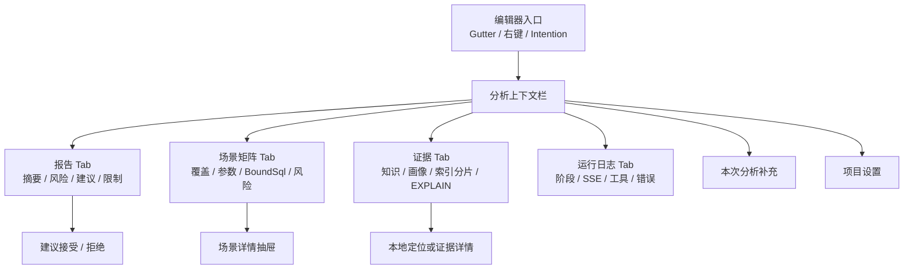
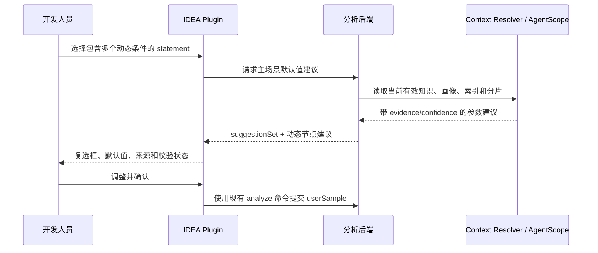
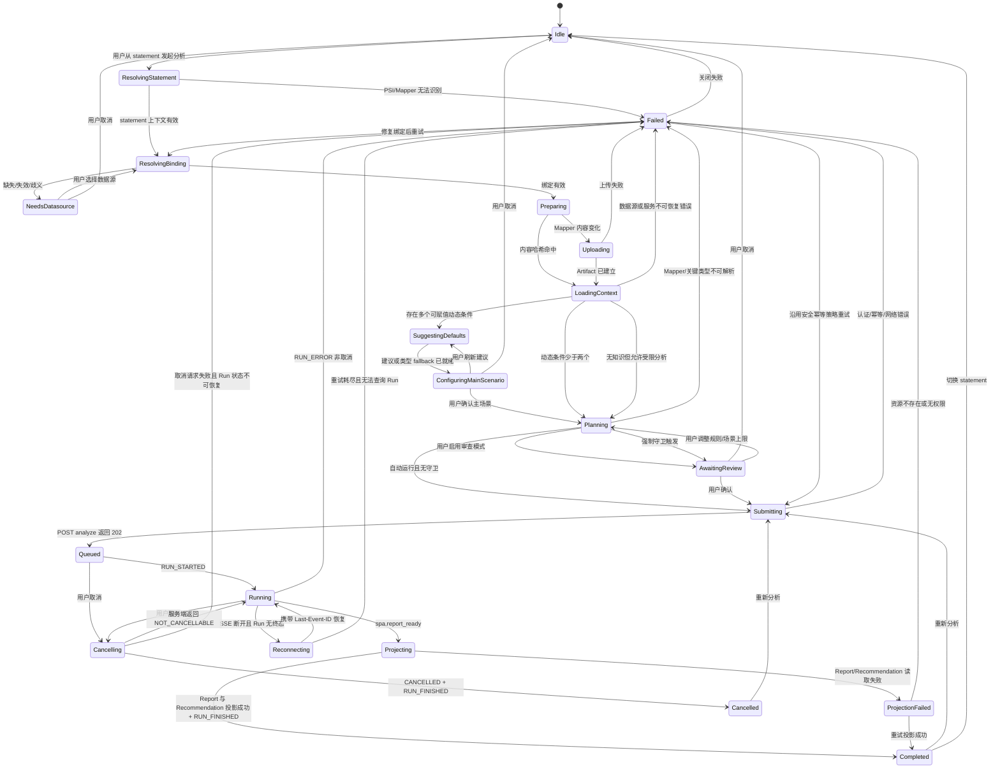
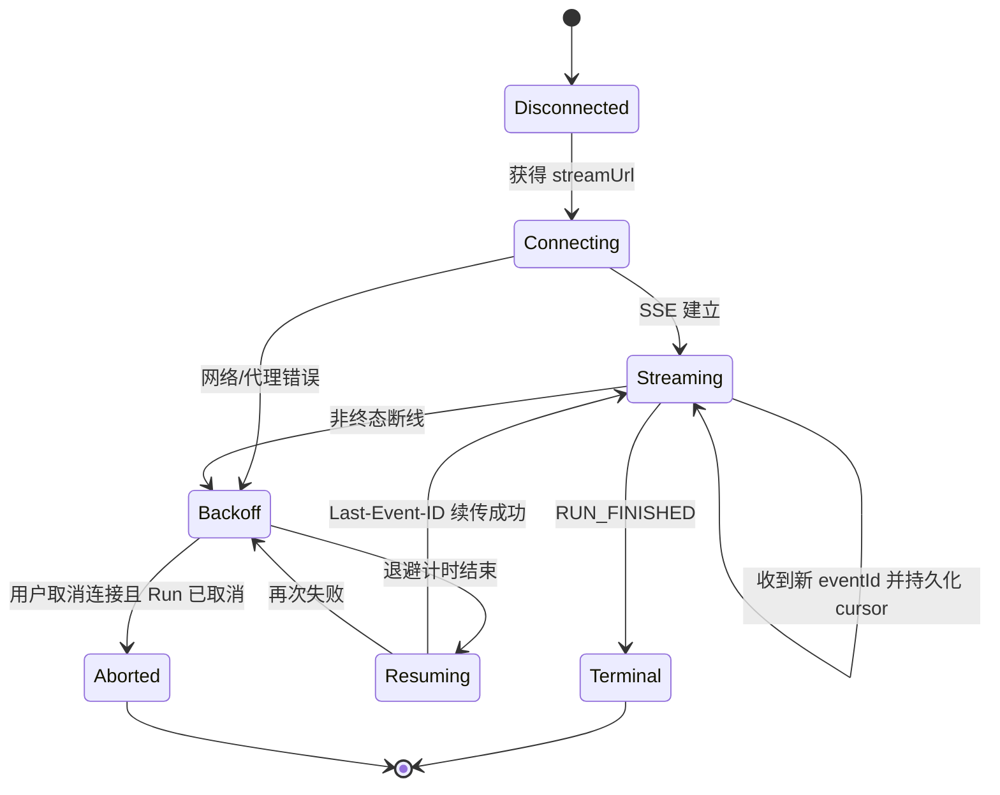

# IDEA Plugin UI/UX 线框图与状态机

> 状态：设计评审稿，尚未进入编码阶段
> 日期：2026-07-28
> 适用范围：SQL Performance Analyzer IDEA Plugin
> 设计基线：`docs/cloud-code-next-goal.md` §6、`docs/contracts/ag-ui-mapping.md`
> 冲突处理：本文是 IDEA Plugin UI/UX 的最新设计基线；与旧文档冲突时以本文为准。
> 本文只冻结信息架构、线框图、交互状态与验收口径，不修改 Plugin 或后端实现。

## 1. 设计目标

1. 用户在 MyBatis statement 上直接发起分析，不手工填写 namespace、statementId、runId。
2. 默认一键完成；多动态条件主场景确认、数据源缺失/歧义、风险守卫或用户审查模式才暂停。
3. 报告是主界面，场景、证据和运行日志用于解释与审计。
4. 所有风险和建议都能追溯到场景与证据。
5. SELECT/WITH 与更新类 statement 的安全边界在界面上持续可见。
6. SSE 断线、恢复、取消、失败和报告投影失败必须是不同状态。
7. Token 只进入 PasswordSafe；业务临时规则不进入知识库或 Agent 长期记忆。
8. 多个 MyBatis 动态条件必须让用户确认一条主场景参数，后台只负责提供带证据的默认值建议。

## 2. 已冻结的交互原则

| 议题 | 设计结论 |
|---|---|
| 默认执行方式 | 自动运行；项目设置可切换为“场景确认后运行” |
| 强制暂停条件 | 数据源缺失/歧义、`${}` 无可信白名单、场景或成本超限、关键类型/LanguageDriver 不可解析 |
| 主导航 | 报告、场景矩阵、证据、运行日志 |
| 报告与建议 | 合并在“报告”Tab |
| 数据源绑定 | statement 临时选择 > module 默认 > project 默认 |
| 多动态条件 | 复选框定义用户主场景；后台提供一次默认值建议；系统覆盖场景保持独立 |
| 临时业务规则 | 只作用于当前 Run；终态后清除，不进入知识库或长期记忆 |
| 更新类 statement | 只读静态分析；持续显示安全提示 |
| 证据定位 | 能定位则打开本地来源；不能定位则显示来源坐标和内容 |
| 跨视图导航 | 风险、场景、证据、Mapper 之间使用稳定 ID 双向跳转，并保留返回路径 |
| 历史与过期 | 历史报告以服务端为准；上下文指纹变化后明确标记“结果已过期” |
| 鉴权状态 | 只显示 PasswordSafe/后端返回的状态与到期时间，不显示或复制 Token |
| 状态事实来源 | 服务端持久化 Run/AG-UI 事件；禁止从自然语言文本猜测状态 |

### 2.1 外部知识与基准数据依赖

IDEA Plugin 只消费后端解析后的有效知识、画像和元数据，不负责维护。完整的导入、版本、AgentScope 检索、默认值建议和后台管理设计见：

- `docs/knowledge-and-baseline-administration-design.md`

## 3. 信息架构



界面分成三个稳定区域：

1. **上下文栏**：statement、数据源、知识版本、画像快照、只读边界和 Run 操作。
2. **主内容区**：报告、场景矩阵、证据、运行日志四个 Tab。
3. **全局状态条**：当前阶段、连接状态、最后事件 ID、错误和恢复操作。

## 4. 主 Tool Window 线框图

### 4.1 空状态

```text
┌─ SQL Analyzer ───────────────────────────────────────────────────────────────┐
│ 未选择 MyBatis statement                          DataSource: Library-Dev ▾  │
│ Knowledge: 自动选择已发布版本                     Profile: 最新完成快照      │
├──────────────────────────────────────────────────────────────────────────────┤
│ [报告] [场景矩阵] [证据] [运行日志]                           [项目设置 ⚙]   │
├──────────────────────────────────────────────────────────────────────────────┤
│                                                                              │
│                    将光标放在 MyBatis statement 上                           │
│                                                                              │
│          使用 Gutter、右键“分析 SQL 性能”或 Alt/Option + Enter               │
│                                                                              │
│                   最近分析                      [筛选 ▾] [查看全部]          │
│                   · LoanMapper.findOverdueLoans      HIGH                    │
│                   · BookMapper.searchBooks           MEDIUM                  │
│                                                                              │
├──────────────────────────────────────────────────────────────────────────────┤
│ 就绪 · 后端已连接 · Token 已保存在 PasswordSafe                              │
└──────────────────────────────────────────────────────────────────────────────┘
```

规则：

- 空状态不显示 Token 输入框、namespace、statementId 或 runId 输入框。
- Token 未配置时显示“连接后端”主操作，不直接显示明文 Token。
- “最近分析”只用于恢复服务端已存在的 Report，不创建新 Run。
- 默认显示当前 project/module 最近 10 条，按服务端完成时间倒序；提供“查看全部”而不是本地无限缓存。
- “查看全部”支持按 statement、数据源、严重度、完成时间和过期状态筛选。
- 服务端报告的保留、归档和删除由后台治理策略决定；Plugin 只允许清理有上限的本地展示缓存，不提供硬删除报告入口。
- Mapper 内容、数据源或知识版本变化后，历史结果显示“可能已过期”，不得冒充当前分析结果。

### 4.2 statement 已识别、尚未开始

```text
┌─ SQL Analyzer ───────────────────────────────────────────────────────────────┐
│ LoanMapper.xml / findOverdueLoans · SELECT     DataSource: Library-Dev ▾    │
│ Knowledge: library-domain@v3                 Profile: snap_20260728          │
│ Module: library-dao                         [本次分析补充…] [开始分析]       │
├──────────────────────────────────────────────────────────────────────────────┤
│ [报告] [场景矩阵] [证据] [运行日志]                           [项目设置 ⚙]   │
├──────────────────────────────────────────────────────────────────────────────┤
│ 分析范围                                                                     │
│  ✓ MyBatis 官方 BoundSql                                                     │
│  ✓ 已发布业务知识、画像、索引和分片                                          │
│  ✓ 普通只读 EXPLAIN（可安全执行时）                                          │
│                                                                              │
│ 运行方式：自动运行                                    预计场景：≤ 20         │
│ 动态条件：5 个 · 主场景已确认                         [配置主场景…]          │
│ 临时规则：0 条                                           [查看分析范围]       │
├──────────────────────────────────────────────────────────────────────────────┤
│ 就绪 · Mapper 内容已去重 · 数据源绑定来自 module                             │
└──────────────────────────────────────────────────────────────────────────────┘
```

### 4.3 运行中

```text
┌─ SQL Analyzer ───────────────────────────────────────────────────────────────┐
│ LoanMapper.xml / findOverdueLoans · SELECT     DataSource: Library-Dev ▾    │
│ Knowledge: library-domain@v3                 Profile: snap_20260728          │
│ Run: run_01…  Session: session_01…                   [取消] [在编辑器中定位] │
├──────────────────────────────────────────────────────────────────────────────┤
│ [报告] [场景矩阵 (10)] [证据 (8)] [运行日志]                                 │
├──────────────────────────────────────────────────────────────────────────────┤
│ 阶段                                                                         │
│  ✓ 上传 Mapper（内容已去重）                                                 │
│  ✓ 加载知识、画像、索引和分片                                                │
│  ✓ 生成场景矩阵                                                             │
│  ● 获取只读执行计划                                                         │
│  ○ 组装并校验报告                                                           │
│  ○ 投影优化建议                                                             │
│                                                                              │
│ 当前：场景 4 / 10 · 普通 EXPLAIN · 12s                                      │
├──────────────────────────────────────────────────────────────────────────────┤
│ SSE 已连接 · Last-Event-ID: 1842 · 最近事件：spa.phase_changed              │
└──────────────────────────────────────────────────────────────────────────────┘
```

规则：

- 运行中默认保留用户当前 Tab，不强制切换到日志。
- 顶部“取消”只在 Run 可取消时启用。
- 进度来自结构化事件；没有百分比依据时不显示伪精确百分比。
- 推理 token 和工具原始输出只在“运行日志”中折叠展示。

### 4.4 完成状态：报告优先

```text
┌─ SQL Analyzer ───────────────────────────────────────────────────────────────┐
│ LoanMapper.xml / findOverdueLoans · SELECT     DataSource: Library-Dev ▾    │
│ Knowledge: library-domain@v3                 Profile: snap_20260728          │
│ 完成于 14:32 · 18s                  [重新分析 ▾] [导出 ▾] [复制报告链接]   │
├──────────────────────────────────────────────────────────────────────────────┤
│ [报告] [场景矩阵 (10)] [证据 (8)] [运行日志]                                 │
├──────────────────────────────────────────────────────────────────────────────┤
│ ┌ 结论摘要 ────────────────────────────────────────────────────────────────┐ │
│ │ HIGH · 置信度 0.91                                                       │ │
│ │ 核心瓶颈：跨分片扫描叠加 due_at 范围过滤，现有索引无法覆盖主路径。       │ │
│ └──────────────────────────────────────────────────────────────────────────┘ │
│                                                                              │
│ 关键风险                                                                     │
│  HIGH  跨分片扫描                     场景 4, 7 · 证据 3                    │
│  HIGH  组合索引未覆盖过滤顺序           场景 1, 4 · 证据 2                  │
│  MED   ACTIVE 借阅形成热点               画像 snap_20260728                  │
│                                                                              │
│ 优化建议                                                                     │
│ ┌ P0 · 调整 loan 组合索引 ────────────────────────────────────────────────┐ │
│ │ 问题：过滤列与路由列顺序不匹配                                          │ │
│ │ 证据：idx_loan_member / shard_loan / plan_04              [查看证据]    │ │
│ │ 建议：评审 (member_id, status, due_at) 候选索引，不自动执行 DDL          │ │
│ │ 置信度 0.92                                     [接受] [拒绝]          │ │
│ └──────────────────────────────────────────────────────────────────────────┘ │
│                                                                              │
│ 限制与缺失证据                                                               │
│  · 场景 8 使用自定义 TypeHandler，未执行 EXPLAIN。                           │
├──────────────────────────────────────────────────────────────────────────────┤
│ 已完成 · Report report_01… · Recommendation 2 条                             │
└──────────────────────────────────────────────────────────────────────────────┘
```

建议反馈规则：

- “接受/拒绝”是服务端 Recommendation Feedback，不是本地 Project Flag。
- 操作成功后卡片显示操作者、时间和当前决定，并在状态栏给出轻量反馈。
- 拒绝必须填写原因；接受可以添加可选备注。
- 不自动创建 Jira/工单，不自动执行 DDL，不自动修改 Mapper。
- 若建议含候选 DDL，可提供“复制候选 DDL”，并持续标记“需人工评审、未执行”。

重新分析与导出规则：

- “重新分析”下拉提供“沿用上次参数”“刷新上下文后分析”“切换数据源后分析”；每次都创建新 Run，并保留与来源 Report 的关联。
- 报告出现 Mapper、数据源绑定、知识版本或画像版本不匹配时，在上下文栏显示不可忽略的“报告已过期”横幅，并提供“按当前上下文重新分析”。
- 第一阶段导出 Markdown 和标准 JSON。HTML 只有在统一脱敏、链接授权和渲染契约冻结后启用；PDF 延后到报告服务或后台管理端实现。
- 只有服务端提供稳定、带租户鉴权的 Report URL 时才显示“复制报告链接”；否则只允许复制 reportId，不生成伪链接。

### 4.5 更新类 statement 的持续只读状态

```text
┌─ SQL Analyzer ───────────────────────────────────────────────────────────────┐
│ LoanMapper.xml / closeExpiredLoans · UPDATE    DataSource: Library-Dev ▾    │
│ ⚠ 只读静态分析：不会执行 UPDATE，不会执行可能触发 DML 的 EXPLAIN ANALYZE，  │
│   不会修改数据库或 Mapper。                                      [了解详情] │
├──────────────────────────────────────────────────────────────────────────────┤
│ [报告] [场景矩阵] [证据] [运行日志]                                          │
│ …                                                                            │
└──────────────────────────────────────────────────────────────────────────────┘
```

只读提示必须：

- 在运行前、运行中和报告完成后都保持可见。
- INSERT、UPDATE、DELETE 使用同一安全规则。
- 不允许被普通状态消息覆盖。
- 固定在上下文栏下方、主 Tab 滚动区之外，不随报告或场景内容滚动消失。

### 4.6 报告投影失败

```text
┌─ SQL Analyzer ───────────────────────────────────────────────────────────────┐
│ LoanMapper.xml / findOverdueLoans · SELECT     DataSource: Library-Dev ▾    │
│ Run 已完成 · Report report_01…                         [重新分析 ▾]          │
├──────────────────────────────────────────────────────────────────────────────┤
│ [报告 ⚠] [场景矩阵 (10)] [证据 (8)] [运行日志]                              │
├──────────────────────────────────────────────────────────────────────────────┤
│                                                                              │
│                  报告视图暂时无法加载                                        │
│                                                                              │
│       Run 已完成，服务端报告不会丢失。                                       │
│       原因：报告资源暂时不可用 / 本地渲染失败                                │
│                                                                              │
│             [重试加载报告]  [查看运行日志]  [导出原始 JSON]                  │
│                                                                              │
├──────────────────────────────────────────────────────────────────────────────┤
│ 分析成功 · 仅报告投影失败 · Last-Event-ID: 1842                              │
└──────────────────────────────────────────────────────────────────────────────┘
```

投影失败只占据“报告”Tab 内容区，不使用模态弹窗，也不覆盖场景、证据和日志。

### 4.7 编辑器 Gutter 状态

| 状态 | Gutter 表现 | Tooltip |
|---|---|---|
| 未分析/结果过期 | 默认分析图标 | 分析 SQL 性能 |
| 正在分析 | 平台标准进行中图标 | 正在分析；点击打开 Tool Window |
| 已完成且 contentHash/数据源仍匹配 | 完成标记 | 最近完成时间、严重度、数据源 |
| 已失败 | 警告标记 | 失败摘要；点击查看 |

完成标记不是永久代码注解：Mapper contentHash、module 数据源绑定或服务端报告版本变化后自动转为“结果可能已过期”。

## 5. 场景矩阵线框图

### 5.1 多动态条件的用户主场景

当选中的 statement 存在两个或以上可赋值动态条件（主要是 `<if test>`、`<when test>`、`<foreach collection>`）时，Plugin 在正式分析前展示一次“主场景参数”交互。

```text
┌─ 配置本次主场景 ─────────────────────────────────────────────────────────────┐
│ LoanMapper.findOverdueLoans · 检测到 5 个动态条件                            │
│ 后台建议：library-domain@v3 + snap_20260728                    [刷新建议]    │
│ 分组：[路由 2] [过滤 2] [排序 1] [其他 1]              [预览 BoundSql]      │
├────┬────────────────────────────────┬────────────┬────────────────┬───────────┤
│填充│ MyBatis test / 参数            │ 默认值     │ 建议依据       │ 校验      │
├────┼────────────────────────────────┼────────────┼────────────────┼───────────┤
│ ☑  │ status != null                │ ACTIVE ▾   │ 画像 Top-K     │ 可用      │
│ ☑  │ startTime != null             │ 2026-04-28 │ 最近三个月规则 │ 可用      │
│ ☐  │ branchId != null              │ 101        │ 主分片元数据   │ 未启用    │
│ ☐  │ keyword != null               │ ␠ 1个空格  │ String fallback│ 低置信度  │
│ ☑  │ branchIds != null && !empty   │ [101]      │ 分片元数据     │ 可用      │
├────┴────────────────────────────────┴────────────┴────────────────┴───────────┤
│ `<choose>`：借阅类型                                                         │
│  (●) OVERDUE   ( ) ACTIVE   ( ) otherwise                                   │
│                                                                              │
│ 勾选 = 在“用户主场景”中填入非空值；未勾选 = 传 null/缺失值。                 │
│ 系统仍会另外生成 true/false、choose 和 foreach 覆盖场景。                    │
│ ⚠ keyword：低置信度 · 无业务依据 · 仅技术 fallback                          │
│                                                                              │
│ [全部取消] [使用无业务证据 fallback]                    [确认主场景并分析]   │
└──────────────────────────────────────────────────────────────────────────────┘
```

#### 5.1.1 复选框语义

- 复选框只决定“用户主场景”中该动态条件所需参数是否填值，不删除系统覆盖场景。
- 勾选后该行必须有类型正确的值，并由 MyBatis 官方 `getBoundSql(parameterObject)` 验证实际分支。
- 未勾选时参数使用 `null`、缺失属性或空集合，以该节点的真实 OGNL 语义为准。
- 同一参数被多个 test 引用时只维护一个共享值；表达式要求冲突时禁止继续并展示冲突节点。
- 嵌套 `<if>` 的子节点跟随父节点缩进；父节点未启用时子节点禁用。
- `<choose>/<when>` 语义互斥，使用单选按钮，不使用可同时勾选的复选框。
- `<foreach>` 使用空/单值/多值集合控件；不能用字符串空格代替集合。
- `<bind>`、`<where>`、`<trim>`、`<set>` 等不直接接收参数的结构节点只展示，不提供填值复选框。
- 条件分组优先使用后台返回的可解释分类与证据；不可用时按 XML 结构和参数角色确定性回退到“路由、过滤、排序/分页、关联、其他”，不得由 Plugin 猜测业务含义。
- 低置信度或无业务依据的建议默认不勾选，使用警告图标、文本标签和可读说明共同标识，不能只依赖红色或边框颜色。
- “预览 BoundSql”是用户显式操作：Plugin 提交当前类型化参数，由后端调用 MyBatis 官方 `MappedStatement.getBoundSql` 返回脱敏预览和实际命中的 nodeId；Plugin 不实现本地 SQL 拼接器。

#### 5.1.2 默认值规则

后台建议优先级：

1. 当前 Run 已确认的参数事实或 `${}` 白名单。
2. 后台已发布的业务规则、状态码和枚举。
3. 最新有效画像的 Top-K、分位数、min/max。
4. 索引和主/二级分片路由字段。
5. 参数类型的确定性 fallback。

类型 fallback：

| 参数类型/表达式 | 无业务证据时的 fallback |
|---|---|
| String 且 test 只要求非 null | 一个 U+0020 空格；UI 必须显示为 `␠ 1个空格`，不能显示成空白输入框 |
| String 且还有非空、格式或枚举约束 | 不使用空格；填可见示例值或要求用户选择 |
| Boolean | 使用能使目标 test 为 true 的 true/false |
| 整数/小数 | 根据比较表达式选择满足边界的最小合法值，不能统一用字符串 |
| 日期/时间 | 使用业务时间规则、画像分位数或明确显示的当前相对时间 |
| 枚举/状态码 | 优先使用已发布枚举或画像 Top-K；无依据时要求用户选择 |
| Collection/Array | 空、单值或受控多值集合 |
| 嵌套对象 | 构造最小参数对象/Map，并保证父路径非 null |

空格 fallback 只解决“String 非 null”这一种技术条件，不代表真实业务语义，必须标记为低置信度且默认不自动勾选。

#### 5.1.3 一次后台建议交互

流程：



要求：

- Plugin 对同一个 `contentHash + statementId + datasourceProfileId + contextVersion` 自动请求一次。
- 用户编辑复选框和值时不重复调用后台；只有点击“刷新建议”才重新请求。
- 用户点击“预览 BoundSql”可以发起独立的只读校验请求；它不改变“一次自动建议”的约束，不创建 Run，也不读取生产数据。
- 后台读取已有知识和画像，不在本次点击中临时抽样生产数据库。
- 每条建议必须返回类型、来源、版本、locator、置信度和原因。
- 后台不可用时仍可使用类型 fallback，但 UI 必须显示“无业务证据”。
- 用户确认结果作为一个保留优先级最高的 `userSample/mainPath`，不成为正式知识。

### 5.2 自动运行模式

```text
┌─ 场景矩阵 ───────────────────────────────────────────────────────────────────┐
│ 覆盖 14 / 14 目标 · 10 个场景 · 3 个证据来源       [仅风险] [导出场景摘要]  │
├────┬──────────────────┬───────────────┬──────────────┬──────────┬─────────────┤
│ #  │ 场景             │ 来源          │ 覆盖目标     │ 指纹     │ 风险        │
├────┼──────────────────┼───────────────┼──────────────┼──────────┼─────────────┤
│ 1  │ 主路径           │ 业务规则      │ MAIN_PATH    │ a81c…    │ —           │
│ 2  │ 无 memberId      │ 分片定义      │ SHARD_MISS   │ e122…    │ 跨分片      │
│ 3  │ ACTIVE 高频值    │ 画像 Top-K    │ TOP_K_HIGH   │ 993f…    │ 热点        │
│ 4  │ due_at 大范围    │ 画像分位数    │ RANGE_P95    │ 17b0…    │ 大扫描      │
│ 5  │ foreach 多值     │ XML 结构      │ FOREACH_MULTI│ 2ee1…    │ 参数规模    │
├────┴──────────────────┴───────────────┴──────────────┴──────────┴─────────────┤
│ 选中场景 4                                                                  │
│ 原因：验证 P95 时间范围与 ACTIVE 高频值组合后的扫描范围。                    │
│ 参数：status=ACTIVE · dueAt=<masked> · branchIds=[101, 205]                  │
│ BoundSql：SELECT … WHERE status = ? AND due_at < ?                           │
│ [复制脱敏 SQL] [查看证据] [定位动态标签]                                    │
└──────────────────────────────────────────────────────────────────────────────┘
```

跨视图导航规则：

- 报告风险点击“场景 4”后打开“场景矩阵”、选中稳定 `scenarioId` 并展开详情；点击证据后打开“证据”Tab 并选中稳定 `evidenceId`。
- 场景和证据详情提供“返回风险”或导航历史，避免用户丢失原上下文。
- “查看完整执行计划”仅在该场景确有 EXPLAIN 证据时启用；没有证据时展示缺失原因，不能生成占位计划。
- 定位动态标签必须使用 PSI/服务端 locator，并在文件移动后尝试通过 namespace、statementId 和项目索引重新解析。

### 5.3 审查模式或强制守卫

```text
┌─ 运行前检查场景 ─────────────────────────────────────────────────────────────┐
│ ⚠ 需要确认：检测到 `${orderBy}`，且没有可信白名单。                          │
│                                                                              │
│ 场景：12 个 / 已包含 11 个             预计成本：中 → 中                     │
│ 数据源：Library-Dev                 执行计划：仅安全 SELECT                  │
│                                                                              │
│ 包含  场景 ID       场景                         成本       约束              │
│  ☑    scn_main      主路径                       低         必选              │
│  ☑    scn_dollar    orderBy = due_at             中         守卫              │
│  ☐    scn_p95       due_at P95 大范围            高         已排除            │
│                                                                              │
│ `${orderBy}` 本 Run 白名单                                                    │
│  参数 [orderBy________]  允许值 [due_at, created_at________________]          │
│                                                                              │
│ [取消本次分析] [保存选择]                              [确认并继续分析]      │
└──────────────────────────────────────────────────────────────────────────────┘
```

强制守卫不能被项目的“自动运行”设置绕过。

场景审查规则：

- 每个场景使用服务端稳定 `scenarioId`；排除后不重新编号。
- 报告保留“已排除场景”审计摘要，但风险和建议不得引用未执行场景。
- 主路径、安全守卫和服务端标记的保留场景不可取消勾选。
- 用户取消可选场景后实时更新“已包含数量”和粗粒度成本等级。
- `confirm` 请求只提交 included/excluded scenario IDs 和排除原因，不允许客户端重写 BoundSql。

| 守卫 | UI 行为 | 允许继续的条件 |
|---|---|---|
| 无数据源绑定 | 打开数据源选择 | 选择一个当前 client 可见的数据源 |
| 多个同等匹配数据源 | 打开数据源选择并解释匹配来源 | 用户明确选择 |
| `${}` 无白名单 | 打开场景审查 | 用户给出本 Run 白名单或取消 |
| 场景数/预计成本超阈值 | 展示场景数与成本等级 | 用户确认或降低上限 |
| 自定义 LanguageDriver/关键类型不可解析 | 展示 UNSUPPORTED 原因 | 排除不支持场景或取消 |

守卫默认显示为 Tool Window 内的持久卡片。需要选择数据源或编辑白名单时可以打开对话框；用户返回编辑器后，卡片仍保留，并提供“重新检测”“选择数据源”“取消本次分析”，避免进入无法继续的灰色状态。

### 5.4 成本提示与排除策略

- 只有服务端返回 EXPLAIN、画像或方言成本模型等证据时，才展示预计行数、成本等级或区间；每个数值必须标注来源、时间和置信度。
- 不把普通 EXPLAIN 的 cost 伪装成毫秒。预计执行时间只有在存在可审计的历史观测或安全基准时显示，并使用区间而不是伪精确值。
- 用户可以设置“需要确认的最大成本等级/预计行数”，触发 REVIEW 守卫；服务端决定某场景是否允许排除。
- 主路径、安全守卫、`${}` 校验和服务端标记的 required 场景不能因成本阈值自动排除。
- 可选场景被成本策略排除时记录为 `SKIPPED_BY_COST_POLICY`，报告保留策略、阈值和排除原因。

## 6. 数据源绑定线框图

### 6.1 顶部快速切换

```text
DataSource: Library-Dev ▾
┌──────────────────────────────────────────────┐
│ ✓ Library-Dev        module 默认             │
│   Library-Staging    project 可用            │
│   Library-Archive    只读                    │
├──────────────────────────────────────────────┤
│ 为 module `library-dao` 记住本次选择  [✓]    │
│ 管理数据源绑定…                              │
└──────────────────────────────────────────────┘
```

### 6.2 缺失或歧义弹窗

```text
┌─ 选择分析数据源 ─────────────────────────────────────────────────────────────┐
│ `library-dao` 尚未绑定数据源。以下数据源均匹配当前 Mapper：                  │
│                                                                              │
│ ○ Library-Dev       MySQL 8.4 · schema library · 最新画像 2h 前             │
│ ○ Library-Staging   MySQL 8.4 · schema library · 最新画像 1d 前             │
│                                                                              │
│ ☑ 记住为 module `library-dao` 的默认数据源                                   │
│                                                                              │
│ [取消]                                                     [使用此数据源]    │
└──────────────────────────────────────────────────────────────────────────────┘
```

数据源显示名称、方言、schema 和画像新鲜度，不要求用户识别内部 ID。

module 由当前 statement 的 PSI/项目模型确定，不能在 Plugin 中手工伪造或切换。用户可以修改“已解析 module 的数据源绑定”，也可以切换到另一个数据源进行一次性分析；若要分析另一个 module，必须先定位并选择该 module 中的 statement。

## 7. Run 级临时业务规则线框图

```text
┌─ 本次分析补充 ───────────────────────────────────────────────────────────────┐
│ 仅作用于当前 Run；运行结束后清除；不会进入知识库或 Agent 长期记忆。          │
│                                                                              │
│ 类型             目标/参数          关系          值                         │
│ [参数事实 ▾]     [memberId____]     [必定存在 ▾] [____________________]      │
│ [允许值 ▾]       [orderBy_____]     [IN______ ▾] [due_at, created_at___]      │
│ [时间范围 ▾]     [loan.due_at__]    [最近____ ▾] [3 months____________]      │
│                                                        [+ 添加一条]          │
│                                                                              │
│ 补充说明（只作低信任上下文，不可解除安全守卫）                              │
│ [本次调用来自逾期借阅批处理___________________________________________]      │
│                                                                              │
│ 来源：用户本次输入 · 可信度：用户声明 · 非正式知识             3 条约束      │
│ [清空] [预览影响] [取消]                                    [校验并应用]    │
└──────────────────────────────────────────────────────────────────────────────┘
```

规则：

- 安全相关信息使用类型化约束行，不使用无法验证的纯自然语言。
- 约束至少支持：参数事实、允许值、数值/时间范围和用户样例。
- `${}` 白名单只能由专用“允许值”约束解除守卫，并由服务端再次校验。
- 补充说明可以保留自由文本，但只作为低信任上下文，不能改变只读、安全或租户边界。
- Plugin 负责字段完整性和基本类型校验；服务端是最终校验者，并返回逐条错误。
- UI 必须标明它不是已发布知识。
- 报告审计只能标记“使用了 Run 临时规则”和规则数量；默认不复制原文。
- 基础设施若必须为异步 Worker 短期保存，应加密、限定 Run 作用域并在终态/TTL 后删除。
- “预览影响”只在用户显式触发时调用后端确定性重规划，展示新增/移除场景、覆盖目标、守卫和成本等级的差异；不在每次键入时请求，也不预测尚未运行的性能风险。

## 8. 证据 Tab 与定位线框图

本节只定义报告证据在 Plugin 中的只读展示；知识导入、版本、检索和后台页面见 `docs/knowledge-and-baseline-administration-design.md`。

```text
┌─ 证据 ───────────────────────────────────────────────────────────────────────┐
│ [全部 8] [业务知识 3] [画像 2] [索引/分片 2] [执行计划 1]                   │
├──────────────────────────────┬───────────────────────────────────────────────┤
│ 业务知识                     │ 证据详情                                      │
│ ▸ overdue-definition @v3     │ 类型：EXCEL_PUBLISHED                         │
│   loan.status @v3            │ 来源：library-domain.xlsx                     │
│                              │ 定位：rules / row 3 / description              │
│ 画像                         │ 版本：3 · 置信度：0.98                         │
│ ▸ loan.status / snap_0728    │ 内容：逾期定义为 ACTIVE 且 due_at < now       │
│   loan.due_at / snap_0728    │                                               │
│                              │ 被以下对象引用                                 │
│ 索引与分片                   │ · 场景 1、3、4                                 │
│   idx_loan_member            │ · 风险 risk_cross_shard                       │
│   shard_loan                 │ · 建议 rec_covering_index                     │
│                              │                                               │
│ 执行计划                     │ [复制来源坐标] [后台查看（未来）]              │
│   plan_scenario_04           │                                               │
└──────────────────────────────┴───────────────────────────────────────────────┘
```

定位策略：

| 证据类型 | 首选操作 | 回退展示 |
|---|---|---|
| Mapper XML | 打开本地文件并定位 statement/动态标签 | Artifact 内容 + mapperPath + locator |
| Java 注解 Mapper | PSI 定位 `@Select/@Update/@Insert/@Delete` 方法或关联 statement | namespace + method + annotation locator |
| 后台非结构化知识 | Plugin 内只读证据预览 | 内容片段 + source/version/locator |
| Excel/结构化知识 | Plugin 内只读表格/字段预览 | 文件名 + Sheet/行/列 + 单元格内容 |
| 画像 | 打开内置画像详情 | snapshot、采集时间、样本量、统计口径 |
| 索引/分片 | 打开内置元数据详情 | 来源、版本、确认状态、采集时间 |
| EXPLAIN | 打开内置执行计划详情 | 场景、方言、采集时间、原始只读输出 |

业务知识默认不假设开发人员本地存在原始 Excel/Markdown，也不由 Plugin 调用系统 Excel。Plugin 展示后端返回的只读证据快照；未来后台管理端完成后，可以按权限提供“在后台管理端查看”深链接，并始终提供“复制 source/version/locator”。只有 Mapper XML 和可由 PSI 确定解析的 MyBatis 注解 Mapper 等当前项目源码才提供本地文件直接定位；无法唯一解析时禁用跳转并解释原因。

## 9. 运行日志与连接状态线框图

```text
┌─ 运行日志 ───────────────────────────────────────────────────────────────────┐
│ Run run_01…   [阶段事件 ✓] [工具调用 ✓] [连接事件 ✓] [推理细节 ○]           │
├──────────────────────────────────────────────────────────────────────────────┤
│ 14:31:02  RUN_QUEUED                         event 1831                      │
│ 14:31:03  RUN_STARTED                        event 1832                      │
│ 14:31:03  PARSING_MAPPER                     event 1833                      │
│ 14:31:04  RESOLVING_CONTEXT                  event 1834                      │
│ 14:31:05  SCENARIOS_READY · 10               event 1835  [查看场景]          │
│ 14:31:06  TOOL explain_sql · scenario 1      event 1836  [展开]              │
│ 14:31:09  SSE 连接中断 · 1.2s 后重连         cursor 1836                    │
│ 14:31:10  SSE 已恢复 · 从 event 1837 续传                                   │
│ 14:31:18  REPORT_READY                       event 1841  [打开报告]          │
│ 14:31:19  RUN_FINISHED                       event 1842                      │
├──────────────────────────────────────────────────────────────────────────────┤
│ SSE 已结束 · Last-Event-ID: 1842 · 无事件丢失                                │
└──────────────────────────────────────────────────────────────────────────────┘
```

规则：

- 默认隐藏模型推理细节，显示业务阶段、工具、连接和终态。
- 事件按 event ID 去重；重连补发不能在 UI 中重复。
- 连接失败与 Run 失败严格分离：SSE 断开不等于分析失败。
- 网络中断、429 和服务端明确标记为 retryable 的 5xx 使用有上限的指数退避并显示倒计时；用户可以取消重试。
- 401/Token 到期进入“需要重新认证”，保留未提交的配置；只有确认请求未创建 Run 或幂等键可安全重放时才自动恢复。
- 解析错误、UNSUPPORTED、参数校验失败和非幂等冲突不自动重试；优先提供“定位 XML/Java 注解”“查看不支持原因”。
- 自动重试必须复用幂等键和 SSE cursor，不能创建重复 Run 或重复事件。

## 10. 项目设置线框图

```text
┌─ Settings / Tools / SQL Analyzer ────────────────────────────────────────────┐
│ Server                                                                       │
│   Backend URL            [http://localhost:18881________________________]     │
│   Connection             已连接 · client idea-library          [测试连接]   │
│   Token                  有效 · 2026-07-29 18:00 到期           [重新认证]   │
│                                                                              │
│ Analysis                                                                     │
│   运行方式               (●) 自动运行  ( ) 场景确认后运行                   │
│   最大场景数             [20____]                                            │
│   成本提示阈值           [中 ▾]                                              │
│                                                                              │
│ Data Sources                                                                 │
│   Project 默认           [Library-Dev ▾]                                     │
│   module 绑定            library-dao → Library-Dev              [管理…]     │
│                                                                              │
│ Local Cache                                                                  │
│   展示缓存               24 MB / 上限 100 MB                  [清理本地缓存] │
│                                                                              │
│ Backend Context（只读）                                                      │
│   业务知识               由后台按 client/project/data source 自动绑定        │
│   画像与元数据           使用最新有效版本                                    │
│                                                                              │
│ Product Safety（不可配置）                                                   │
│   ✓ 更新类 statement 始终只做只读静态分析                                   │
│   ✓ `${}` 无可信白名单时强制确认                                             │
│                                                                              │
│ [恢复默认]                                                   [取消] [应用]   │
└──────────────────────────────────────────────────────────────────────────────┘
```

业务知识版本策略、画像基准和元数据版本由后台管理端维护，Plugin 只显示本次生效结果。安全规则是产品不变量，不使用可勾选或可被 `.idea` 文件修改的设置控件。

Token 状态只来自 PasswordSafe 是否存在凭据和后端鉴权响应；只有后端明确返回 `expiresAt` 才显示到期时间。重新认证不显示旧 Token，也不把凭据写入项目设置、日志或剪贴板。“清理本地缓存”不删除服务端 Report、Run 或知识。

## 11. 产品状态机



### 11.1 状态显示和可用操作

| 状态 | 主提示 | 主操作 | 取消 | 数据源切换 |
|---|---|---|---:|---:|
| Idle | 选择 statement | 在编辑器中发起分析 | 否 | 是 |
| NeedsDatasource | 需要选择数据源 | 使用此数据源 | 是 | 是 |
| SuggestingDefaults | 正在获取动态参数建议 | 使用类型 fallback | 是 | 否 |
| ConfiguringMainScenario | 确认动态条件与默认值 | 确认主场景并分析 | 是 | 可返回修改 |
| LoadingContext/Planning | 正在准备分析 | 查看运行日志 | 是 | 否 |
| AwaitingReview | 需要用户确认 | 确认并继续 | 是 | 可返回修改 |
| Queued/Running | 当前业务阶段 | 查看报告/日志 | 是 | 否 |
| Reconnecting | SSE 重连中，显示 cursor | 立即重试连接 | 是 | 否 |
| Projecting | 报告已生成，正在加载视图 | 查看日志 | 是 | 否 |
| Completed | 分析完成 | 重新分析 | 否 | 是 |
| ProjectionFailed | Run 完成但视图加载失败 | 重试加载报告 | 否 | 是 |
| Cancelled | 已取消 | 重新分析 | 否 | 是 |
| Failed | 显示结构化错误与可恢复性 | 按错误类型重试 | 否 | 是 |

## 12. SSE 连接子状态机



连接状态不得改变业务状态：

- `Backoff/Resuming` 时 Run 仍可以处于 Queued、Running 或 Projecting。
- 客户端始终保存最后一个已消费 event ID。
- 收到重复 event ID 时忽略，不重复更新场景、报告或建议。
- 只有服务端终态事件或 Run 查询结果能结束业务 Run。
- SSE 重连期间仍允许发送独立 REST 取消请求；取消操作必须 single-flight、携带幂等键，并在请求未完成时禁用重复点击。
- 如果网络导致取消请求失败，显示“取消尚未确认”，保留 Run 状态并提供重试或查询状态；不能仅因 SSE 断开永久禁用取消。

## 13. 服务端事件到 UI 状态的映射

| 服务端事件 | UI 状态/动作 |
|---|---|
| HTTP 202 + streamUrl | Queued；建立 SSE |
| `RUN_QUEUED` | 显示已入队和 runId |
| `RUN_STARTED` | Running |
| `spa.phase_changed(PARSING_MAPPER)` | 正在解析 Mapper |
| `spa.phase_changed(RESOLVING_CONTEXT)` | 正在加载知识、画像、索引和分片 |
| `spa.scenarios_ready` | 更新场景矩阵；AUTO 继续，REVIEW 进入 AwaitingReview |
| EXPLAIN/工具事件 | 更新当前场景和证据，不切换主 Tab |
| `spa.report_ready(reportId)` | Projecting；GET Report |
| `spa.recommendations_ready` | 刷新报告内建议 |
| `RUN_ERROR(code=CANCELLED)` | Cancelling/Cancelled |
| 其他 `RUN_ERROR` | Failed；显示 code、message、retryable |
| `RUN_FINISHED` | 根据 status 进入 Completed/Cancelled/Failed |

禁止使用日志文本包含“完成”“失败”等关键词来判断状态。

## 14. 为实现设计所需的契约补充

以下是后续编码 Goal 必须先冻结的契约，本次不实现：

1. 增加 `POST /api/v1/mapper-statements/default-parameters/suggest`：
   - 请求只携带 artifact/statement/data source/project/module 等绑定标识
   - 服务端使用 MyBatis 官方解析得到稳定 dynamic `nodeId` 和参数类型
   - 响应包含 suggestionSet/contextVersion、建议值、source/version/locator/confidence/reason
   - 多个节点共享参数、嵌套父子关系和 choose 分组必须显式返回
   - 可解释的条件分类只能作为展示元数据；必须允许客户端按结构确定性回退
2. 增加 `POST /api/v1/mapper-statements/default-parameters/preview`：
   - 请求携带 suggestionSetId、node selections 和类型化 parameter object
   - 服务端只调用 MyBatis 官方 `getBoundSql`，返回脱敏 BoundSql、命中 nodeIds 和逐字段校验错误
   - 不创建 Run、不执行 SQL、不把参数写入正式知识
3. `POST /api/v1/mapper-statements/analyze` 增加：
   - `executionMode: AUTO | REVIEW`
   - 类型化 `transientRules`（kind/target/operator/values）
   - 用户确认的 `mainScenario`（node selections + typed parameter object + suggestionSetId）
   - 可选 `maxScenarios` 与成本阈值
4. 服务端必须重新校验 mainScenario 类型，并调用 `getBoundSql` 验证实际动态分支；Plugin 的勾选结果不是可信 SQL。
5. REVIEW 或强制守卫模式需要持久化可恢复的 `AWAITING_CONFIRMATION` 状态。
6. 增加 `POST /api/v1/runs/{runId}/confirm`，携带 included/excluded scenario IDs 与排除原因，继续同一个 Run，不创建第二条分析链路。
7. 增加临时规则的只读 preview/replan 契约，返回场景、覆盖、守卫和成本等级差异；不得返回未经分析的预测风险。
8. `spa.scenarios_ready` 需要携带：
   - 稳定 scenarioId、场景摘要、覆盖目标、指纹
   - required/optional 标记和成本等级
   - 守卫原因
   - 是否必须确认
   - 成本等级，不暴露敏感参数
9. 报告 evidence 必须提供稳定的 `sourceType/sourceId/version/locator`，Plugin 才能定位。
10. 数据源列表需要返回显示名称、方言、schema、module/project 绑定来源和最新画像时间。
11. Run 查询需要返回服务端业务状态和最后 event ID，供 SSE 重连失败后的恢复判断。
12. 报告上下文指纹至少包含 Mapper contentHash、statementId、data source binding、knowledge contextVersion 和 profile snapshot/version。
13. 成本字段必须区分 estimatedRows、dialectCost、observedDurationRange 和 evidence；服务端返回 required/excludable 与排除原因。
14. 鉴权响应仅在真实可用时返回 `expiresAt`；Report 分享只返回稳定、租户鉴权的 URL，不允许客户端拼接。
15. 临时规则和 mainScenario 只属于 Run；不得进入知识库、长期记忆或跨 Run 默认值。
16. Recommendation Feedback 由服务端保存操作者、决定、原因和时间；Plugin 只展示并提交反馈。
17. 后端负责按 client/project/data source 解析当前有效知识和基准版本，Plugin 请求不得直接上传或替换可信知识集合；详细边界见 `docs/knowledge-and-baseline-administration-design.md`。

## 15. IDEA 平台设计标准

- 使用 IntelliJ Platform 原生主题、间距、字体、图标和 `JB*` 组件。
- 支持 Light/Darcula 和系统缩放，不硬编码颜色与像素密集布局。
- 所有主操作可通过键盘访问；Tab 顺序与视觉顺序一致。
- 表格支持键盘选择，详情区随选择更新，不用 hover 承载必要信息。
- 分析入口注册为 IntelliJ Action 并允许用户在 Keymap 中配置；不占用 IntelliJ 已有的 `Ctrl/Cmd+Shift+A`。对话框支持 Enter 确认、Esc 取消，列表支持方向键。
- 状态、严重度和低置信度不能只靠颜色表达；必须同时提供文字或图标语义，并具备可访问名称。
- 错误信息包含“发生了什么、是否可重试、用户下一步”，不展示堆栈。
- 后端 URL、项目设置与 module 绑定属于 Project；Token 属于 PasswordSafe。
- UI 线程只做渲染，网络、SSE、文件定位与报告解析在后台执行。
- 所有外部打开动作在执行前验证目标存在且属于当前项目或受信来源。
- 不自动执行 DDL，不自动修改 Mapper，不执行 DML 或 EXPLAIN ANALYZE。

## 16. 设计验收清单

进入编码前，设计评审至少确认：

- [ ] 四个主 Tab 的信息层级和命名。
- [ ] AUTO、REVIEW 和强制守卫三种路径。
- [ ] 多动态条件的 nodeId、父子关系、choose 互斥和共享参数规则。
- [ ] 空格 fallback 只用于纯 String 非 null 条件，并在 UI 中可见标识。
- [ ] 后台默认值建议的证据、缓存键、失败 fallback 和刷新语义。
- [ ] 条件智能分组具备可解释来源与结构回退，低置信度不只靠颜色标记。
- [ ] BoundSql 预览由后端 MyBatis 官方运行时生成，且不创建 Run、不执行 SQL。
- [ ] 用户主场景与系统覆盖场景彼此独立。
- [ ] 临时业务规则的保存边界与终态清理策略。
- [ ] 基础知识/基准数据只由后台管理端维护，Plugin 只读消费。
- [ ] 数据源 module/project 绑定优先级和歧义处理。
- [ ] 更新类 statement 的持续只读提示。
- [ ] Evidence locator 与本地文件映射规则。
- [ ] 风险、场景、证据与 Mapper 的稳定 ID 双向导航和返回路径。
- [ ] 成本字段来源、单位、区间、required/excludable 和跳过审计。
- [ ] 历史报告、过期指纹、服务端保留与本地缓存清理边界。
- [ ] Token 到期、重新认证和分享链接的安全边界。
- [ ] Run 状态与 SSE 连接状态彼此独立。
- [ ] 报告投影失败不被误报为 Run 分析失败。
- [ ] 取消、NOT_CANCELLABLE、失败重试和断线续传路径。
- [ ] 服务端为场景确认提供同 Run 的暂停/继续契约。

编码完成后的 UI 验收至少覆盖：

- [ ] Gutter、右键和 Intention 都能识别正确 statement。
- [ ] 自动运行除多动态条件主场景确认和强制守卫外无多余弹窗。
- [ ] 两个以上可赋值动态条件会展示一次主场景确认。
- [ ] `<if>` 复选、`<choose>` 单选、`<foreach>` 集合输入和嵌套条件联动正确。
- [ ] 后台建议能填充时间、状态码、枚举和分片字段，并显示证据与置信度。
- [ ] 用户可显式预览当前参数的脱敏 BoundSql 与实际命中节点。
- [ ] 用户主场景经 MyBatis `getBoundSql` 验证且作为保留场景进入报告。
- [ ] 五类强制守卫不能被绕过。
- [ ] 数据源绑定按 statement/module/project 优先级工作。
- [ ] 场景、风险、建议与证据可以相互跳转。
- [ ] Java 注解 Mapper 仅在 PSI 可确定解析时定位，无法唯一解析时安全降级。
- [ ] 报告上下文变化后显示过期横幅，重新分析下拉的三条路径正确。
- [ ] 网络/429/retryable 5xx 可有界重试；解析、UNSUPPORTED 和鉴权错误不被盲目重试。
- [ ] Action 可由 Keymap 配置，键盘、屏幕缩放和非颜色状态表达通过验收。
- [ ] Mapper 本地定位、后台知识只读预览和内置证据详情正确。
- [ ] Plugin 中不存在知识导入、发布、回滚、画像调度或抽检入口。
- [ ] SSE 中断后从 Last-Event-ID 恢复且不重复渲染。
- [ ] 更新类 statement 全流程持续显示只读边界。
- [ ] Token 不出现在 Project XML、日志和错误信息中。
- [ ] `runIde` 自动化冒烟和真实 IntelliJ 人工清单全部通过。

## 17. 本阶段明确不做

- 不修改任何 Java/Kotlin、Gradle、Plugin XML 或后端 API。
- 不实现跨报告“建议中心”。
- 不设计自动执行 DDL 或自动改写 Mapper。
- 不展示或持久化模型内部推理过程。
- 不将本次 Run 临时规则自动转成正式知识。
- 不在 IDEA Plugin 中导入、维护、发布、回滚或抽检业务知识和基准数据。
- 不在 P1 实现多 statement/多数据源对比、PDF 导出或服务端 Report 硬删除。
- 不允许用户手工把当前 statement 伪装成另一个 module；只允许调整已解析 module 的数据源绑定。
- 不在本设计阶段决定 Marketplace 发布与商业化流程。

## 18. 用户故事改进建议评审

| Story | 建议 | 结论 | 设计决定 |
|---|---|---|---|
| 1 | Gutter 运行/完成反馈 | 采纳 | 增加进行中、完成、失败和过期状态；结果与 contentHash/数据源绑定 |
| 1 | 最近分析清理策略 | 采纳 | 使用服务端最近 10 条，不维护无界本地 LRU |
| 2 | 返回编辑器后保留守卫和重试入口 | 采纳 | 守卫改为 Tool Window 持久卡片，对话框只承载选择 |
| 3 | 自然语言规则改为 K-V | 部分采纳 | 安全约束使用类型化行；普通说明可保留低信任文本；通用 K-V 不足以表达范围和样例 |
| 4 | 审查时排除场景并反馈成本 | 采纳 | 稳定 scenarioId、不重编号、必选场景不可排除、报告保留排除审计 |
| 5 | 接受/拒绝提供反馈 | 采纳 | 服务端审计反馈并显示状态；不只存本地，不自动建 Jira 或执行 DDL |
| 6 | Excel 默认 IDE 内预览 | 调整后采纳 | Plugin 只读预览报告证据；知识与原始文件交互见独立后台设计文档 |
| 7 | SSE 重连时禁用取消 | 不采纳 | SSE 与取消 REST 独立；保留 single-flight 取消，失败时显示“尚未确认” |
| 8 | 补充 ProjectionFailed 线框图 | 采纳 | 错误占据报告 Tab，不覆盖整个 Tool Window |
| 9 | 安全开关由 `.idea` 锁定 | 不采纳 | `.idea` 不是安全边界；只读/DML 安全是不可配置的产品不变量 |
| 9 | 只读提示固定不随内容滚动 | 采纳 | 固定在上下文栏下方、主 Tab 滚动区之外 |
| 总结 | 操作后轻量反馈 | 采纳 | 状态栏用于常规成功反馈；IDE Notification 只用于后台完成或需用户处理的结果，避免噪声 |
| 新增 | 多 test 标签用复选框定义主场景 | 采纳并校正 | `<if>` 使用复选框；`<choose>` 使用单选；`<foreach>` 使用集合控件；不影响系统覆盖场景 |
| 新增 | 后台提供一次业务默认值 | 采纳 | 后台基于有效知识/画像返回带证据建议，用户确认后作为最高优先级 userSample |
| 新增 | 未知值统一填空格以保证非 null | 部分采纳 | 仅纯 String 非 null 条件允许可见的一个空格 fallback；其他类型必须类型正确 |

## 19. 第二轮用户故事与改进建议评审

### 19.1 EPIC 用户故事结论

| EPIC | 结论 | 纳入本设计的验收口径 |
|---|---|---|
| 1 发起分析 | 采纳并校正 | XML statement 直接发起；Java 入口只支持 PSI 可确定解析的 MyBatis 注解或关联 statement；多动态条件先确认用户主场景；临时规则仅属于 Run |
| 2 数据源与安全 | 采纳 | 数据源按 statement 临时选择、module 默认、project 默认解析；歧义和所有强制守卫必须暂停；module 本身不可手工伪造 |
| 3 运行过程 | 采纳 | 使用结构化阶段事件展示真实进度；SSE 断线续传与 Run 状态分离；取消走独立、幂等的 REST 请求 |
| 4 查看结果 | 采纳 | 报告优先；场景矩阵可解释；证据只读且可定位；风险、场景、证据、Mapper 双向跳转 |
| 5 日志与错误 | 采纳 | 日志默认隐藏内部推理；错误按可恢复性分类；只对安全、幂等、retryable 的错误自动重试 |
| 6 设置与上下文 | 采纳并校正 | 项目设置管理后端、运行模式、场景/成本阈值和数据源绑定；Token 仅显示状态；知识、画像和元数据是后端只读上下文 |

### 19.2 十三项改进建议结论

| # | 建议 | 结论 | 设计决定与阶段 |
|---:|---|---|---|
| 1 | 条件智能分组、BoundSql 预览、低置信度强标记 | 调整后采纳 | 分组必须可解释并有结构回退；预览由后端 MyBatis 官方运行时生成；低置信度使用图标+文字且默认不勾选，不能只用红色 |
| 2 | 风险→场景→证据深链与完整计划 | 采纳 | 使用稳定 riskId/scenarioId/evidenceId，自动切 Tab、选中并展开，保留返回路径；只有真实 EXPLAIN 证据存在时才能打开完整计划 |
| 3 | 多 statement/多数据源对比；重新分析下拉 | 拆分 | 重新分析下拉纳入首阶段；对比分析延后为独立 EPIC，待指标对齐、并发 Run、权限和版面契约冻结后再做，首阶段不放空入口 |
| 4 | 知识后台深链、复制 locator、Java 注解 Mapper 定位 | 调整后采纳 | Plugin 只读跳转后台且受权限控制，始终可复制 locator；Java 注解仅在 PSI 能唯一解析时跳转，不能解析时明确降级 |
| 5 | 更精确成本、最大成本自动排除 | 部分采纳 | 展示有证据的预计行数、方言成本和区间；普通 EXPLAIN 不转换成毫秒；阈值先触发 REVIEW，可选场景才允许按服务端策略排除，必选场景不排除 |
| 6 | 历史筛选/删除/归档、保留期、本地清理 | 部分采纳 | Plugin 支持服务端历史筛选和有上限的本地缓存清理；服务端保留、归档、删除属于后台治理，Plugin 不提供硬删除，项目设置不控制服务端保留期 |
| 7 | Mapper 变化后的过期横幅与定位 | 采纳 | 使用完整上下文指纹判定过期；提供按当前上下文重新分析；文件移动后尝试 PSI/项目索引解析，无法定位时禁用并解释 |
| 8 | 无障碍与快捷键 | 调整后采纳 | Action 进入 IntelliJ Keymap，由用户配置；不占用平台已有 `Ctrl/Cmd+Shift+A`；支持方向键、Enter/Esc、缩放和非颜色语义 |
| 9 | Token 状态、到期与重新认证 | 采纳 | 只显示 PasswordSafe/后端确认的状态；仅在服务端提供 `expiresAt` 时显示倒计时；401 保留未提交配置并进入重认证，不暴露凭据 |
| 10 | 分享链接、HTML/PDF 导出 | 分阶段采纳 | Markdown+标准 JSON 先行；稳定租户鉴权 URL 存在时才复制链接；HTML 待统一脱敏/渲染后启用；PDF 延后到报告服务或后台 |
| 11 | 临时规则影响预览 | 调整后采纳 | 用户显式请求后由后端确定性重规划，展示场景/覆盖/守卫/成本差异；不在每次键入时调用，不预测尚未执行的性能风险 |
| 12 | 手工切换 module/project 绑定 | 不按原建议采纳 | module 由 statement 的 PSI 决定，不允许伪造；允许修改该 module 的数据源绑定或进行一次性数据源切换 |
| 13 | 临时错误自动重试与解析错误定位 | 采纳 | 网络、429、retryable 5xx 有界退避；401 走重认证；解析/UNSUPPORTED/校验/非幂等冲突不盲重试，并提供源码定位 |

### 19.3 阶段优先级

第一实现阶段（P1）包括：动态条件分组与官方 BoundSql 预览、深链导航、重新分析下拉、过期横幅、Java/XML 定位、成本守卫、临时规则影响预览、鉴权状态、错误分类重试、键盘和无障碍、历史筛选与本地缓存边界。

后续阶段（P2）包括：对比分析、HTML 导出、稳定授权分享链接和后台知识深链。PDF 导出以及 Report/知识的保留、归档和删除放在报告服务或后台管理端规划中，不作为 IDEA Plugin P1 的完成条件。
