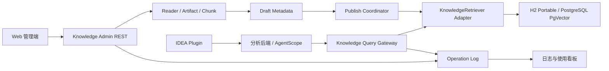
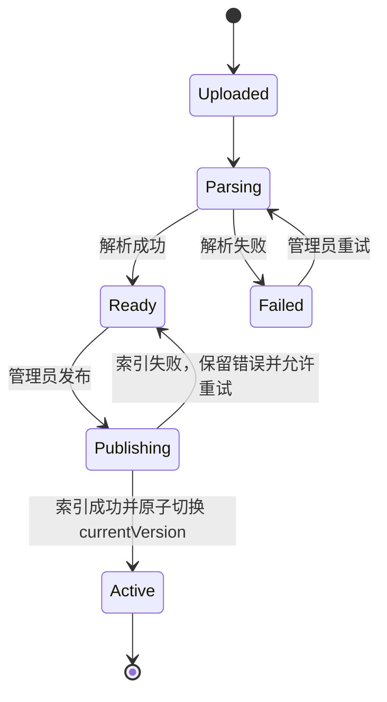

# 轻量级知识服务管理后台交互设计

> 状态：独立产品设计稿，尚未进入编码阶段
> 日期：2026-07-28
> 范围：知识文件上传、发布、抽检，以及知识调用日志与使用情况监控
> 技术基线：项目固定使用 AgentScope Java 2.0.0、Spring Boot、H2/PostgreSQL 双持久化路径
> 关联文档：`docs/idea-plugin-ui-ux-design.md`
> 本文替代此前“大而全”的知识、画像、索引、分片后台设计；不修改现有代码。

## 1. 先冻结的技术事实

### 1.1 AgentScope Java 不是现成的知识管理 REST 服务

项目依赖的 `agentscope-extensions-rag-simple:2.0.0` 是嵌入式 Java 库，不提供本文可直接调用的 `/v1/documents`、`/ingest`、`/activate` 或 `/publish` REST 端点。

AgentScope 2.0.0 的 Simple Knowledge 主要提供：

- Reader：`TextReader`、`PDFReader`、`WordReader`、`TikaReader` 等；
- 文档切块；
- Embedding 模型适配；
- `SimpleKnowledge.addDocuments(...)`；
- `SimpleKnowledge.retrieve(...)`；
- `PgVectorStore`、内存 Store 等向量存储适配。

同时，2.0.0 的核心 `Knowledge` 接口已标记为待移除，并要求检索在应用层集成。因此，本项目应继续保留自己的 `KnowledgeRetriever` 端口和 Spring REST 层，将 AgentScope Reader、Embedding 和向量存储作为可替换实现能力，而不是把不存在的 AgentScope REST API 写进契约。

官方依据：

- [AgentScope Java 2.0.0 Simple Knowledge](https://github.com/agentscope-ai/agentscope-java/blob/v2.0.0/docs/v2/zh/integration/rag/simple.md)
- [AgentScope Java 2.0.0 Knowledge 接口](https://github.com/agentscope-ai/agentscope-java/blob/v2.0.0/agentscope-core/src/main/java/io/agentscope/core/rag/Knowledge.java)

### 1.2 发布、租户和日志必须由本项目承担

AgentScope Simple Knowledge 没有草稿、发布、当前生效版本、管理员角色或操作审计语义。轻量服务仍需在项目数据库中维护最小控制面：

- `clientId` 归属；
- 文件 Artifact 和内容哈希；
- 草稿及当前生效版本；
- 解析/索引状态；
- 发布操作者和发布时间；
- 操作与检索日志。

这是一层薄控制面，不是重新实现 RAG。

### 1.3 当前代码与目标之间的差异

| 能力 | 当前实现 | 本设计目标 |
|---|---|---|
| 上传 | 只支持受控模板 `.xlsx`；接口为 `POST /api/v1/knowledge-sources/imports` | 增加 `.md/.txt/.pdf/.xlsx` 的非结构化导入入口 |
| 草稿/发布 | 已有 `knowledge_source`、`knowledge_version`、DRAFT/PUBLISHED 和 currentVersion | 复用并简化为草稿 + 当前生效版本 |
| 回滚 | 当前已有 rollback API | 不作为 P1 Web 页面能力；保留兼容性，不扩展复杂版本治理 |
| 检索 | 已有 `KnowledgeRetriever`；H2 使用可移植 embedding，PostgreSQL 可用 PgVector | 继续复用同一端口，不另造检索算法 |
| AgentScope RAG | 已引入 Simple Knowledge 依赖，但当前检索由项目端口封装 | 可在 Adapter 内复用 AgentScope Reader/Embedding/Store |
| 发布一致性 | 当前向量索引是 best-effort，异常被吞掉 | 发布失败必须可见；新版本索引失败时旧版本继续生效 |
| 日志/统计/CSV | 尚无知识操作日志、看板和导出 | 新增轻量操作日志与聚合查询 |
| 权限 | Bearer Token 目前只能解析 `clientId`，没有 Admin/Viewer RBAC | 管理 API 增加最小角色/权限校验 |

## 2. 产品定位与边界

本系统是“知识文件管理 + 检索抽检 + 使用观测”的轻量 Web 管理服务。核心能力只有四组：

1. 上传文件并解析为可索引文档；
2. 发布一个草稿，使其成为当前可检索版本；
3. 使用与 Agent 分析完全相同的检索链路执行抽检；
4. 记录知识管理与检索调用，提供查询、统计和 CSV 导出。



明确不做：

- 不重新实现 AgentScope 的 Reader、切块、Embedding 或向量相似度算法；
- 不建设画像、索引元数据、主/二级分片、调度计划或数据治理门户；
- 不提供复杂版本差异、审批流或多级回滚 UI；
- 不在 Web 管理端内嵌 IDEA Plugin 的 SQL 分析功能；
- 不记录或展示模型内部思维过程；
- 不允许 IDEA Plugin 维护基础知识。

现有画像、索引和分片能力可以继续服务 SQL 分析，但不属于本轻量 Web 管理端的信息架构，也不作为本 Goal 的新增或重构范围。

## 3. 用户角色与权限

| 角色 | 允许操作 |
|---|---|
| `KNOWLEDGE_ADMIN` | 上传、发布、抽检、查看日志与统计、导出 CSV |
| `KNOWLEDGE_VIEWER` | 查看当前知识、执行抽检、查看允许范围内的日志与统计 |
| `AGENT_CLIENT` | 只调用已发布知识的检索接口，不访问管理页面和管理写接口 |

约束：

- `clientId` 必须从已认证身份派生，不能信任请求体或查询参数中的任意 `clientId`。
- 当前 Token 模型只有 client 认证、没有角色授权；RBAC 是实现本管理端前必须补齐的契约。
- IDEA Plugin Token 默认只有 `AGENT_CLIENT` 权限，不因后台深链接获得管理写权限。

## 4. 知识上传

### 4.1 交互

Web 页面提供拖拽和文件选择：

```text
┌─ 上传知识文件 ───────────────────────────────────────────────────────────────┐
│ 将 PDF、Markdown、Text 或 Excel 拖到此处                                    │
│ 单文件上限：由服务端配置显示                         [选择文件]             │
│                                                                              │
│ library-domain.md       184 KB       SHA-256 已校验                          │
│ 知识源名称 [图书管理业务知识____________________________]                   │
│                                                                              │
│ [取消]                                                     [上传并解析]      │
└──────────────────────────────────────────────────────────────────────────────┘
```

上传完成后进入草稿，不立即进入 Agent 检索范围。知识列表展示：

- 文件名和知识源名称；
- 文件类型、大小和内容哈希；
- 上传人和上传时间；
- `UPLOADED / PARSING / READY / FAILED / PUBLISHING / ACTIVE`；
- Chunk 数量和失败摘要；
- 当前生效版本号。

### 4.2 文件处理策略

| 文件 | 首选处理方式 | Locator 最低保证 |
|---|---|---|
| `.md/.txt` | AgentScope `TextReader` 或确定性文本 Reader | 标题/段落或 chunk index |
| `.pdf` | AgentScope `PDFReader`；失败时可回退 `TikaReader` | chunk index；只有 Reader 真正返回页码时才展示页码 |
| `.xlsx` | 默认按非结构化文档通过 `TikaReader`；现有受控模板可继续走 `ExcelKnowledgeParser` 兼容路径 | Sheet/行/列仅在解析器确实提供时展示，否则为 chunk index |

不能承诺 Reader 没有返回的页码、Sheet 或单元格坐标。所有检索结果至少具备：

```text
sourceId + versionNo + chunkId/locator + contentHash
```

### 4.3 上传规则

- 原文件先进入现有 `ArtifactService`，再解析、切块。
- 服务端计算 SHA-256；同一 `clientId + sourceId + contentHash` 重复上传返回已有草稿，避免重复索引。
- 文件类型由内容和扩展名共同校验，不能只信任 `Content-Type`。
- 文件大小、解析时间、最大 Chunk 数和压缩包展开大小必须有限制。
- 上传/解析是异步状态；Web 页面轮询即可，P1 不要求新增 SSE。
- 解析失败保留可诊断摘要，不记录原文到普通日志。

## 5. 发布

### 5.1 生命周期



### 5.2 发布一致性

发布不是 AgentScope 原生状态，而是本项目的最小控制面：

1. 校验草稿仍属于当前 `clientId` 且状态为 `READY`；
2. 调用 `KnowledgeRetriever.index(...)` 或对应 AgentScope Adapter 建立该版本索引；
3. 索引成功后，在管理数据库事务中把 `knowledge_source.current_version_id` 切换到新版本；
4. 检索始终按 currentVersion 过滤；
5. 任一步失败都不得把新版本显示为 ACTIVE，旧版本继续可检索。

必须修正当前 `KnowledgeImportService.indexSafely(...)` 吞掉索引异常的行为。轻量化不等于静默失败。

P1 不提供复杂回滚页面。发布失败可以重试；已发布版本可以由兼容 API 恢复，但不扩展版本差异和审批工作流。

## 6. 抽检工作台

抽检必须调用与 Agent 分析相同的 `KnowledgeRetriever` 和有效版本过滤逻辑，不能建立一条仅供页面演示的检索链路。

```text
┌─ 知识抽检 ───────────────────────────────────────────────────────────────────┐
│ 知识范围 [当前全部生效知识 ▾]              Top-K [(●) 5  ( ) 10]           │
│ Query [贷款状态有哪些枚举值？________________________________________]      │
│                                                           [执行抽检]         │
├──────────────────────────────────────────────────────────────────────────────┤
│ 1  score 0.91  图书管理业务知识 @2                                           │
│    “loan.status 包含 ACTIVE、OVERDUE、CLOSED …”                              │
│    locator: enums / row 3                                  [复制 locator]    │
│                                                                              │
│ 2  score 0.84  loan-policy.md @1                                              │
│    “逾期借阅仍保持 ACTIVE，归还后变为 CLOSED …”                              │
│    locator: 逾期规则 / paragraph 2                         [复制 locator]    │
└──────────────────────────────────────────────────────────────────────────────┘
```

规则：

- `topK` 只允许服务端白名单值，例如 5 或 10，并有最大上限。
- 默认检索当前租户的全部 ACTIVE 知识；可以限定一个当前租户可见的 `sourceId`。
- 返回 Chunk 原文的脱敏投影、来源、版本、locator、score 和检索耗时。
- score 是检索实现返回的相似度，不改写成“模型置信度”。
- Query 不默认写入日志原文；日志只保存长度、哈希和可选的安全分类。
- “3 秒内返回”作为健康依赖、预热完成和固定数据集下的 P95 服务目标，不作为外部 Embedding 服务异常时的绝对承诺。

## 7. 用户交互日志与使用情况

### 7.1 记录范围

记录以下服务边界事件：

- Web：`UPLOAD`、`PUBLISH`、`SAMPLE`、`EXPORT_LOGS`；
- Agent/IDEA 分析链路：`RETRIEVE`；
- 系统任务：`PARSE`、`INDEX`。

不复制 AG-UI 的全部事件到知识日志。现有 `run_event` 继续记录 Run/AG-UI 事件，知识日志只保存知识调用摘要，并可通过 `traceId/runId/sessionId` 关联。

### 7.2 最小日志模型

建议新增数据库中立的 `knowledge_operation_log`，由 Flyway 在 H2/PostgreSQL 两条路径创建：

| 字段 | 说明 |
|---|---|
| `id` | 服务端生成的日志 ID |
| `trace_id` | 跨 Web、服务和 AgentScope Adapter 的链路 ID |
| `client_id` | 认证得到的租户 |
| `actor_id` / `actor_type` | 操作者或 Agent Client |
| `operation_type` | UPLOAD/PARSE/PUBLISH/SAMPLE/RETRIEVE/INDEX/EXPORT_LOGS |
| `source_id` / `version_id` | 可为空的知识定位 |
| `run_id` / `session_id` | 来自分析链路时用于关联 |
| `request_summary_json` | 已脱敏的文件名、文件大小、Top-K、Query 长度/哈希等 |
| `response_status` | SUCCESS/FAILED |
| `error_code` | 稳定错误码，不保存堆栈 |
| `duration_ms` | 服务边界耗时 |
| `result_count` | 检索命中数或处理 Chunk 数 |
| `token_consumed` | 仅在依赖真实返回时记录，否则为 null |
| `created_at` | 服务端时间 |

禁止写入：

- Bearer Token、API Key、数据库凭据；
- 未脱敏 Query 原文；
- 完整文件内容或 Chunk 原文；
- 模型内部推理；
- Java 堆栈和可能含敏感值的第三方响应体。

### 7.3 看板

首页提供轻量卡片：

- 今日知识操作量：UPLOAD/PUBLISH/SAMPLE；
- 今日 Agent 检索量及成功率；
- P50/P95 检索耗时；
- 热门知识源 Top 5；
- 最近 10 条操作；
- 按操作者统计的上传、发布和抽检次数。

“热门知识源”按一次 RETRIEVE 中命中的唯一 source 计一次，不能因同一文件返回多个 Chunk 而重复膨胀。P1 使用 15～30 秒轮询，不要求实时流式看板。

### 7.4 日志查询与 CSV

- 筛选：时间范围、操作人、操作类型、状态、sourceId、traceId。
- 使用游标或稳定分页；默认按 `created_at DESC, id DESC`。
- 详情只展示脱敏摘要和关联 ID。
- CSV 导出使用与列表相同的租户和权限过滤。
- CSV 对以 `= + - @` 开头的单元格进行转义，防止表格公式注入。
- 导出量必须有限制；大导出使用异步任务或缩小时间范围。

日志保留期属于服务端配置，不放到 IDEA Plugin 项目设置中。P1 必须给出默认值并支持部署侧调整。

## 8. Web 信息架构

```text
知识服务管理
├── 知识库
│   ├── 当前生效知识
│   ├── 草稿与处理状态
│   └── 上传新文件
├── 抽检工作台
│   ├── Query 与知识范围
│   └── Chunk、来源、版本、locator、score
└── 观测中心
    ├── 使用概览
    ├── 日志明细
    └── CSV 导出
```

只保留三个一级页面。画像、索引、分片、调度、冲突审核和复杂版本治理不出现在导航中。

## 9. REST API 目标契约

管理 API 和 Agent 检索 API 分域。以下是本项目需要实现的目标契约，不是 AgentScope 原生端点：

```text
# Web 管理端
POST /api/v1/admin/knowledge-sources/imports
GET  /api/v1/admin/knowledge-sources
GET  /api/v1/admin/knowledge-sources/{sourceId}
POST /api/v1/admin/knowledge-versions/{versionId}/publish
POST /api/v1/admin/knowledge-samples

GET  /api/v1/admin/knowledge-operations
GET  /api/v1/admin/knowledge-operations/stats
GET  /api/v1/admin/knowledge-operations/export.csv

# Agent/分析后端只读检索
GET  /api/v1/knowledge/search?q=...&sourceId=...&limit=...
```

约束：

- 上传使用 `multipart/form-data`；其他写请求使用 JSON。
- 所有写请求支持幂等键；重复点击发布不得重复建立有效版本。
- 异步上传返回 `202 Accepted + operationId/statusUrl`；若实现为同步小文件路径，也必须返回稳定的 sourceId/versionId。
- 错误使用项目统一的 RFC 9457 Problem Details。
- 分页、时间格式、request ID 和幂等遵循 `docs/contracts/rest-api.md`。
- 当前 `/api/v1/knowledge-sources/**` 可作为迁移期兼容入口；新 Web 页面只使用 `/api/v1/admin/**`。

## 10. 与 AgentScope 及当前代码的映射

| Web/服务能力 | 实际调用边界 | 是否由 AgentScope 原生提供 |
|---|---|---|
| 文本/PDF 读取 | AgentScope Reader；必要时项目 Adapter 补充 metadata | 是，Java 类库能力 |
| Excel 非结构化读取 | `TikaReader` 或项目 Reader Adapter | 部分；没有草稿/发布语义 |
| Excel 受控模板兼容 | 当前 `ExcelKnowledgeParser` | 否，项目现有能力 |
| 文档加入向量库 | `KnowledgeRetriever.index(...)`，Adapter 可使用 SimpleKnowledge/Store | 底层能力是；租户/版本由项目封装 |
| 抽检/Agent 检索 | `KnowledgeRetriever.search(...)`，固定 currentVersion | 底层能力是；REST 和版本过滤由项目封装 |
| 草稿/发布 | `knowledge_source`、`knowledge_version` + Publish Coordinator | 否 |
| 租户/RBAC | Spring Security/当前 Token 模型的扩展 | 否 |
| 操作日志/统计/CSV | Web 拦截器 + Service decorator + 项目数据库 | 否 |

## 11. IDEA Plugin 边界

IDEA Plugin 仍然只做开发人员交互：

- 展示本次分析实际引用的知识版本和证据；
- 查看脱敏 Chunk、来源和 locator；
- 按权限深链接到 Web 管理端的只读详情；
- 请求后台根据已发布知识生成动态 SQL 默认值建议。

Plugin 不提供上传、发布、抽检、日志导出或知识编辑入口。深链接不能在 URL 中携带 Token、Query 原文或知识原文；无管理端权限时仍可展示报告已经保存的只读证据快照。

## 12. 安全与故障处理

- H2 和 PostgreSQL 必须执行相同的租户隔离与 Repository Contract Test。
- 上传、发布、检索和日志查询全部从认证上下文取得 `clientId`。
- Admin/Viewer/Agent 权限分离；发布和导出至少需要显式权限。
- 文件名只作展示，服务端存储使用生成 ID，防止路径穿越。
- Reader、Embedding 或向量库超时时，返回稳定错误码并写 FAILED 日志。
- 发布失败时旧版本继续 ACTIVE；不得出现“页面显示发布成功但检索不到”。
- 统计接口只返回聚合数据，不能借聚合结果推断其他租户的文件或用户。
- 日志详情和 CSV 继续应用 Query 脱敏、字段级权限和租户过滤。

## 13. P1 验收计划

### 13.1 功能验收

- [ ] `.md/.txt/.pdf/.xlsx` 上传后进入草稿，状态可查询；失败有稳定错误码。
- [ ] 草稿不会被 Agent 检索命中。
- [ ] 发布成功后，同一 `sourceId + versionNo` 可被抽检和 Agent 检索命中。
- [ ] 新版本索引失败时发布不成功，旧 ACTIVE 版本仍可检索。
- [ ] 抽检返回 Chunk 脱敏原文、sourceId、versionNo、locator、score 和耗时。
- [ ] 日志完整记录 UPLOAD/PARSE/PUBLISH/SAMPLE/RETRIEVE/INDEX 的成功与失败。
- [ ] 看板统计与底层日志一致；热门知识按一次请求中的唯一 source 计数。
- [ ] 日志可以筛选、稳定分页并导出安全 CSV。
- [ ] IDEA Plugin 中没有知识写入口。
- [ ] 页面导航中没有画像、索引、分片和调度配置。

### 13.2 安全与隔离验收

- [ ] client A 不能查看、发布、抽检或统计 client B 的知识与日志。
- [ ] VIEWER 不能上传、发布或导出越权数据。
- [ ] AGENT_CLIENT 只能检索 ACTIVE 知识。
- [ ] Token、API Key、Query 原文、文件内容和堆栈不进入普通操作日志。
- [ ] CSV 公式注入样例被正确转义。

### 13.3 自动化门禁

- [ ] H2 Repository/Service Contract Test：上传状态、发布切换、检索过滤、日志和统计。
- [ ] PostgreSQL Testcontainers Contract Test：PgVector 索引、ACTIVE 版本过滤和租户负例。
- [ ] Reader fixture：Markdown、Text、PDF、Excel，断言稳定 Chunk 和最低 locator。
- [ ] 发布故障注入：Embedding/索引失败时旧版本保持可用。
- [ ] API Contract Test：RBAC、Problem Details、幂等、分页与 CSV。
- [ ] 固定数据集和健康依赖下，抽检接口 P95 不超过 3 秒；外部依赖失败走明确降级/错误路径。

## 14. P1 开发顺序

1. 冻结 Admin/Viewer/Agent 权限模型和 REST 契约。
2. 为 H2/PostgreSQL 增加知识处理状态及 `knowledge_operation_log` 前向 Flyway 迁移。
3. 抽取 Reader Adapter，补齐 Markdown、Text、PDF 和非结构化 Excel。
4. 把发布改为“索引成功后原子切换 currentVersion”，移除静默吞错。
5. 增加抽检 API，并强制复用 Agent 分析的检索链路。
6. 增加操作日志、统计和安全 CSV。
7. 实现三个 Web 页面并完成双数据库、租户和故障注入验收。

完成定义：上传、发布、抽检、日志/看板四条链路在 H2 与 PostgreSQL 上通过自动化门禁，并确认 IDEA Plugin 仍无知识管理写入口。
