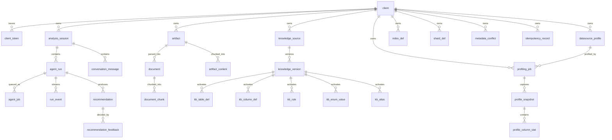

# 持久层架构决策记录（Phase A）

> 状态：已实施并通过双数据库门禁
> 依据：`docs/cloud-code-next-goal.md` §3（数据库中立持久层）
> 相关契约：`docs/contracts/rest-api.md`、`docs/contracts/ag-ui-mapping.md`

## 1. 决策

| 议题 | 决策 | 理由 |
|---|---|---|
| ORM | **Spring Data JDBC**（非 JPA/Hibernate） | 聚合与 SQL 行为显式、可审计；无 Lazy Loading / 隐式级联；与既有 Spring JDBC 代码迁移成本低（Goal §3.2） |
| 建表 | **Flyway 是唯一事实来源**；Java 生产源码禁止 CREATE/ALTER/DROP/TRUNCATE TABLE（守卫测试强制） | 历史迁移视为已部署，只增前向迁移（Goal §3.5） |
| 方言差异 | `persistence/dialect/` SPI：`ManagementDatabaseDialect`（JDBC metadata 检测）+ `JobClaimStrategy`（PG `SKIP LOCKED` / H2 行锁两阶段） | 厂商 SQL 只允许存在于 dialect adapter（Goal §3.5） |
| 标识符渲染 | `NeutralIdentifierDialect`：在检测到的厂商方言之上切换为「不加引号 + 原样大小写」 | 未加引号的标识符在各引擎自动折叠为存储大小写（PG 小写 / H2 大写），同一套实体映射双库，不依赖 H2 兼容模式 |
| AgentScope 状态 | `AgentScopeStoreProvider` 按库选择：PG 用官方 `PostgresAgentStateStore` + 产品 `JdbcBaseStore`；H2 用产品 `H2AgentStateStore` + `JdbcBaseStore` | 官方 `PostgresBaseStore` 2.0.0 的 UPSERT 语句有双逗号语法错误（put 必然失败），故 KV 存储以等价的便携式实现替代；AgentState 仍用官方实现；禁用纯内存实现冒充（Goal §3.6） |
| 租户隔离 | 所有按资源 ID 的查询接受或派生 `clientId`；`index_def`/`shard_def`/`metadata_conflict` 经前向迁移补齐 `client_id NOT NULL + FK` | Goal §3.4/§5 |

## 2. 分层

```
Controller / AG-UI
      │ （只依赖 repository 端口）
repository/            领域中立端口（ClientRepository、SessionRepository、…）
      │
persistence/jdbc/      端口适配器（Jdbc*Repository）
  ├── entity/          Spring Data JDBC 实体（@Table(schema="sql_analyzer")）
  ├── repository/      CrudRepository + @Query（批量/条件查询用 NamedParameterJdbcTemplate）
  └── NeutralIdentifierDialect
persistence/dialect/   ManagementDatabaseDialect + JobClaimStrategy（唯一厂商 SQL 容身处）
agentscope/store/      AgentScopeStoreProvider（PG/H2 持久化组合）
```

ArchUnit 守卫：`service/controller/domain/agui/knowledge/metadata/profiling/scenario/mybatis/agent` 包禁止依赖 `adapter.postgresql`、`adapter.h2` 与 `persistence.*` 内部（只能依赖 `repository` 端口）。

## 3. Flyway 拓扑

| 数据库 | locations | 内容 |
|---|---|---|
| PostgreSQL | `db/migration` + `db/migration-common` | 不可变历史（versions 2–7）+ 可移植前向迁移（8+） |
| H2 | `db/migration-h2` + `db/migration-common` | `V1__h2_baseline.sql`（与 PG 目标 Schema 等价的 clean-install 基线）+ 同一批前向迁移 |

前向迁移（双库共用，可移植 SQL）：

- `V8__client_ownership.sql`：`index_def`/`shard_def`/`metadata_conflict` 增加 `client_id`（回填系统客户端后置 NOT NULL + FK + 复合索引）。
- `V9__idempotency_record.sql`：幂等键存储 `(client_id, idempotency_key)`。
- `V10__agentscope_kv_store.sql`：`agentscope.kv_store`（AgentScope 远端工作区 KV）。

历史文件 checksum 由 `MigrationHistoryGuardTest` 钉住；H2 基线与 PG 历史的等价性由 `SchemaParityTest` 在 Docker 门禁中强制。

## 4. 数据实体目录（sql_analyzer schema，28 张产品表）

| 聚合 | 表 | 租户归属 |
|---|---|---|
| Client/Token | `client`、`client_token` | 根；token 经 `client_id` FK |
| Session/Message | `analysis_session`、`conversation_message` | `analysis_session.client_id`；消息经 session 派生 |
| AgentRun/Job/Event | `agent_run`、`agent_job`、`run_event` | 经 session 派生（`belongsToClient` 连接查询） |
| Artifact/Document/Chunk | `artifact`、`artifact_content`、`document`、`document_chunk` | `artifact.client_id` |
| KnowledgeSource/Version | `knowledge_source`、`knowledge_version`、`kb_table_def`、`kb_column_def`、`kb_rule`、`kb_enum_value`、`kb_alias` | `knowledge_source.client_id`；活动事实查询 JOIN 知识源按 client 过滤 |
| DatasourceProfile | `datasource_profile` | `client_id`（密码不落库，`credential_env` 引用环境变量） |
| ProfilingJob/Snapshot/ColumnStat | `profiling_job`、`profile_snapshot`、`profile_column_stat` | `profiling_job.client_id`；快照/统计经 job 派生 |
| IndexDefinition / ShardDefinition / Conflict | `index_def`、`shard_def`、`metadata_conflict` | `client_id`（V8 补齐） |
| AnalysisReport（Phase C） | 待 `V11` 前向迁移 | `client_id` |
| Recommendation/Feedback | `recommendation`、`recommendation_feedback` | 经 session 派生；`decide()` 在 SQL 内 EXISTS 校验 |
| IdempotencyRecord | `idempotency_record` | `(client_id, idempotency_key)` 主键 |



AgentScope 自有状态（`agentscope` schema，非产品表）：

- PostgreSQL：`agentscope.agentscope_sessions`（官方 `PostgresAgentStateStore` 自建）+ `agentscope.kv_store`（V10，产品 `JdbcBaseStore`）。
- H2：`agentscope.agent_state`（H2 基线，产品 `H2AgentStateStore`）+ `agentscope.kv_store`（V10）。

## 5. 已知限制

- **H2 无 PgVector**：语义向量检索在 H2 模式不可用；结构化检索与 Markdown 切块/嵌入流程仍完整（Phase B 的 `KnowledgeRetriever` 端口在 H2 侧以可移植 embedding + JVM cosine 实现受限候选集检索）。
- **H2 单节点**：Job 认领用行锁两阶段（无 `SKIP LOCKED`），竞争方短暂阻塞而非跳过——与 H2 的本地/开发定位相称。
- **AgentScope 官方 `PostgresBaseStore` 缺陷**：agentscope-extensions-postgresql 2.0.0 的 UPSERT 语句含双逗号（`version = %1$s.version + 1,,`），`put` 必然报语法错误。产品以等价表结构的 `JdbcBaseStore` 替代（官方 `PostgresAgentStateStore` 不受影响，继续使用）。

## 6. 门禁矩阵（Phase A 结果）

| 门禁 | H2（每次构建强制） | PostgreSQL（Docker，CI 强制） |
|---|---|---|
| Flyway 迁移（`H2MigrationContractTest` / `FlywayMigrationContractTest`） | ✅ | ✅ |
| Repository 契约 13 项（CRUD/时间戳/JSON/唯一与外键/事件游标/Job 租约重试/幂等/6 组租户负向） | ✅ `H2RepositoryContractTest` | ✅ `PostgresRepositoryContractTest` |
| AgentScope 状态契约 4 项（round-trip/(user,session) 隔离/列表序/CAS/**重启恢复**） | ✅ 文件库真重启 | ✅ 官方 AgentState + JdbcBaseStore |
| Schema parity（表/列/主外键/业务索引归一化比对） | —（被比对方） | ✅ `SchemaParityTest` |
| 架构守卫（ArchUnit 分层 + DDL 扫描 + 端口厂商命名 + 禁 assumeTrue 静默跳过） | ✅ `PersistenceArchitectureGuardTest` | 同左 |
| 全量套件（117 测试） | ✅ `./gradlew test` | ✅ `RUN_POSTGRES_INTEGRATION_TESTS=true ./gradlew test` |

## 7. 三类能力与业务语义测试矩阵（Phase B/C 结果）

| 能力 | 测试 | H2 | PostgreSQL/目标库 |
|---|---|---|---|
| 索引/分片/二级分片 | `MetadataServiceTest`（冲突创建/接受/拒绝/版本递增、列序保持、主/二级分片键分离存储与投影） | ✅ | 契约同库 |
| 同名表跨 client/datasource 不串数据 | `RepositoryContractTest.metadataIsIsolated…` | ✅ | ✅ |
| loan 单分片/跨分片/二级时间分片场景 | `LibraryScenarioPlanningTest`（官方 BoundSql、指纹去重、cap 20） | ✅ | — |
| 画像确定性（Top-K/null ratio/distinct/分桶/分位数） | `LibraryProfilingTest`（expected-profile.json 精确断言） | — | ✅ MySQL 8.4 目标库 |
| 敏感策略 PLAINTEXT/HASHED/OMITTED | `LibraryProfilingTest`（member_no 64-hex 无明文；isbn 明文）+ `MySqlDialectAdapterTest` | — | ✅ |
| 热点/倾斜断言 | `LibraryProfilingTest`（branch_id 1:5、FICTION 4:6） | — | ✅ |
| 画像持久化 + H2 管理库重启恢复 | `LibraryProfilingTest.profilingResultsSurviveManagementDatabaseRestart` | ✅ | — |
| Excel 模板解析 + 逐行错误（缺列/坏枚举/重复键/坏策略/坏别名类型） | `LibraryExcelKnowledgeTest` | ✅ | — |
| preview/publish/rollback 生命周期 | `KnowledgeImportFlowTest` | ✅ | — |
| 规范化 Markdown 生成（Excel/Markdown 同源）+ 确定性 | `KnowledgeRetrievalContractTestBase.normalizedMarkdownIsDeterministic` | ✅ | ✅ |
| KnowledgeRetriever 契约（证据三元组/置信度/租户隔离/确定性，Fake Embedding 无外部模型） | `KnowledgeRetrievalH2Test`（JSON 嵌入 + JVM cosine） | ✅ | ✅ PgVector（pgvector/pgvector:pg16） |
| 业务语义驱动场景（有/无语义结果必须不同） | `LibraryEndToEndTest.withoutSemanticsScenariosDiffer…` | ✅ | — |
| 标准报告主链路（解析→装载→规划→BoundSql→校验→持久化→建议投影→AG-UI 事件） | `LibraryEndToEndTest.knowledgeAndEvidenceDrive…` | ✅ | — |
| 报告 Schema 单一事实来源 | `ReportSchemaIdentityTest`（classpath 与 docs 字节级一致） | ✅ | — |
| 跨租户负向（报告/事件/快照/统计/知识/元数据） | `LibraryEndToEndTest` + 契约套件 6 组负向 | ✅ | ✅ |

端到端主链路断言（`findOverdueLoans`，H2 每次构建强制）：知识版本 `图书业务知识@1`、画像快照 ID 进入 audit 与每场景；场景证据目标含 `SHARD_SINGLE/SHARD_CROSS/SHARD_SECONDARY_MISSING/FOREACH_*`；单分片场景 BoundSql 含 `member_id = ?`、跨分片场景不含；风险含 `CROSS_SHARD`；场景 ≤20 且指纹去重；`spa.report_ready`/`spa.recommendations_ready` 事件持久化；无知识租户的场景集合与有知识租户可区分。

## 8. 已知限制（更新）

- H2 无 PgVector：语义检索在 H2 侧以可移植 JSON 嵌入 + JVM cosine 在客户端候选集上计算；生产 PostgreSQL 使用 PgVector。
- H2 单节点：Job 认领为行锁两阶段（无 SKIP LOCKED），竞争方短暂阻塞而非跳过。
- 官方 `PostgresBaseStore`（agentscope-extensions-postgresql 2.0.0）UPSERT 语句含双逗号语法错误，产品以等价 `JdbcBaseStore` 替代（官方 `PostgresAgentStateStore` 不受影响）。
- `json-schema-validator` 固定 1.5.6：agentscope 声明依赖 2.0.0 但其字节码零引用 com.networknt（已核验），降级安全。
- 确定性分析路径不执行 EXPLAIN（只读建议边界）；报告 `limits.explainSkipped=true` 明示。
